# Rice Leaf Disease — Báo cáo nghiên cứu (Tiếng Việt)

## Giới thiệu dự án

Mục tiêu nghiên cứu của dự án là xây dựng và đánh giá một hệ thống học sâu đa phương thức (ảnh + văn bản mô tả tiếng Việt + metadata ảnh) nhằm phân loại bệnh lá lúa. Dự án tập trung vào: (1) tạo metadata "image-grounded" tự động từ ảnh, (2) thiết kế mô hình multimodal (EfficientNet-B0 + PhoBERT + cross-attention fusion), và (3) đánh giá toàn diện hiệu năng, hội tụ và khả năng giải thích mô hình.

Tính thực tiễn: hệ thống hướng tới ứng dụng hỗ trợ nông dân trong chẩn đoán sớm BrownSpot, Hispa, LeafBlast và phân loại ảnh Healthy để giảm thiểu rủi ro canh tác.

---

## Bài toán nghiên cứu

Dạng bài toán: phân loại đa lớp (4 lớp) trên tập ảnh lá lúa có kèm metadata và mô tả tiếng Việt. Yêu cầu: đạt độ chính xác và F1 cao đồng thời có khả năng giải thích (XAI) để tin cậy khi triển khai thực địa.

Mục tiêu đánh giá: đo lường khả năng phân biệt các bệnh tương tự (đặc biệt BrownSpot vs LeafBlast), phân tích nguyên nhân lỗi bằng embedding và GradCAM, và báo cáo động lực học huấn luyện (convergence / overfitting / early stopping).

---

## Tổng quan hệ thống

Sơ đồ hệ thống (minh họa):

Giải thích nhanh các thành phần:
- Thu thập & metadata: ảnh thô được lưu theo lớp; metadata tự động sinh dựa trên phân tích pixel (leaf/lesion/background), cùng các trường ngữ nghĩa (texts, symptoms, visual_analysis, annotation_confidence, metadata_quality).
- EDA & metadata generation: pipeline phân tích pixel (HSV + ngưỡng màu) để tính leaf_area_ratio, lesion ratios; từ đó sinh mô tả tiếng Việt và điểm tin cậy.
- Preprocessing: ảnh được resize và augment (RandomHorizontalFlip, RandomVerticalFlip, RandomRotation, ColorJitter) trước khi chuyển sang tensor và normalizing.
- Dataset loader: nạp ảnh, chuỗi văn bản (gộp texts|symptoms|visual_analysis), và vector metadata (one-hot cho weather/severity/growth/location, các tỉ lệ dạng số) vào batch.
- Mô hình: EfficientNet-B0 → projection, PhoBERT → projection, metadata MLP encoder → fusion (cross-attention) → MLP classifier.
- Huấn luyện: AdamW, CosineAnnealingLR, CrossEntropyLoss, AMP, gradient clipping, early stopping theo validation F1; checkpoint lưu best model và full checkpoint.
- Đánh giá & XAI: confusion matrix, ROC/PR, calibration, confidence histograms, t-SNE embedding, GradCAM.

---

## Dataset

Tổng quan thực tế (từ metadata):
- Tổng số mẫu: 3.355 (theo metadata summary).
- Số lớp: 4 — BrownSpot (523), Healthy (1.488), Hispa (565), LeafBlast (779).

Phân bổ lớp:

| Lớp | Số mẫu |
|---|---:|
| BrownSpot | 523 |
| Healthy | 1,488 |
| Hispa | 565 |
| LeafBlast | 779 |
| Tổng | 3,355 |

Nhận xét: sự mất cân bằng lớp rõ ràng (Healthy chiếm ~44%) — điều này ảnh hưởng tới chiến lược huấn luyện (cân nhắc oversampling, class-weighted loss hoặc focal loss).

---

## Quy trình sinh metadata (EDA pipeline)

Tóm tắt luồng từ ảnh gốc tới metadata (dựa trên mã nguồn trong src/datasets/EDA/generate_visual_metadata.py và các hàm EDA):

1. Đọc ảnh RGB và chuyển sang numpy array.
2. Chuyển sang không gian HSV bằng hàm rgb_to_hsv để có hue, saturation, value.
3. Xác định nền trắng: brightness (value) > 0.88 và saturation < 0.12 → mask nền trắng.
4. Xác định leaf_mask = not white_background; leaf_area_ratio = mean(leaf_mask) (tỉ lệ pixel không phải nền trắng trên toàn ảnh).
5. Xác định các mask tổn thương:
   - green_mask: G > R + 10 AND G > B + 10 AND G > 90
   - brown_mask: R > 120 AND G > 60 AND B < 110 AND R > G
   - yellow_mask: R > 150 AND G > 130 AND B < 110 AND R > B
   - white_lesion_mask: brightness > 0.92 AND saturation < 0.2 AND leaf_mask
6. Tính các tỉ lệ: green_ratio, brown_ratio, yellow_ratio, white_lesion_ratio; lesion_ratio = brown_ratio + yellow_ratio + white_lesion_ratio; background_ratio = mean(white_background).
7. Lấy ngưỡng/heuristic để đặt severity (choose_severity) và tính annotation_confidence theo bảng điều kiện trong choose_confidence.
   - Ví dụ: với label==Healthy và lesion_ratio < 0.015 → confidence 0.95; label==LeafBlast nếu lesion_ratio > 0.025 → confidence 0.94, v.v. (tham khảo các ngưỡng cụ thể trong mã nguồn).
8. Sinh các câu mô tả tiếng Việt dựa trên templates class-specific, cộng các câu bổ trợ dựa trên các tỉ lệ (ví dụ: nếu white_background_ratio > 0.4 thêm câu "Lá được chụp trên nền trắng...").

Kết quả: mỗi ảnh được gán fields như texts (3–5 câu), symptoms (sample từ template), visual_analysis (danh sách nhận xét), leaf_area_ratio, background_ratio, lesion_area_ratio, annotation_confidence, metadata_quality, v.v. Các bản ghi được lưu vào `dataset/metadata/all_metadata.json` và `metadata.csv`.

Ý nghĩa: metadata là image-grounded (dựa trên phân tích pixel), có khả năng hỗ trợ cả contrastive learning (image-text) và huấn luyện multimodal có trọng số tin cậy.

---

## Khảo sát dữ liệu (EDA) — minh họa trực quan

Lưu ý: hình ảnh dưới đây là các trực quan đã sinh trong quá trình EDA; bên dưới mỗi ảnh tôi tóm tắt phân tích, nhận xét và ý nghĩa.

Phân tích: biểu đồ thanh cho thấy Healthy chiếm phần lớn; BrownSpot, Hispa, LeafBlast ít hơn.
Nhận xét: mất cân bằng lớp có thể dẫn tới bias về dự đoán lớp chiếm ưu thế.
Ý nghĩa: cần áp dụng kỹ thuật điều chỉnh (class-weight/focal/oversample) hoặc thu thập thêm mẫu cho các lớp thiểu số.

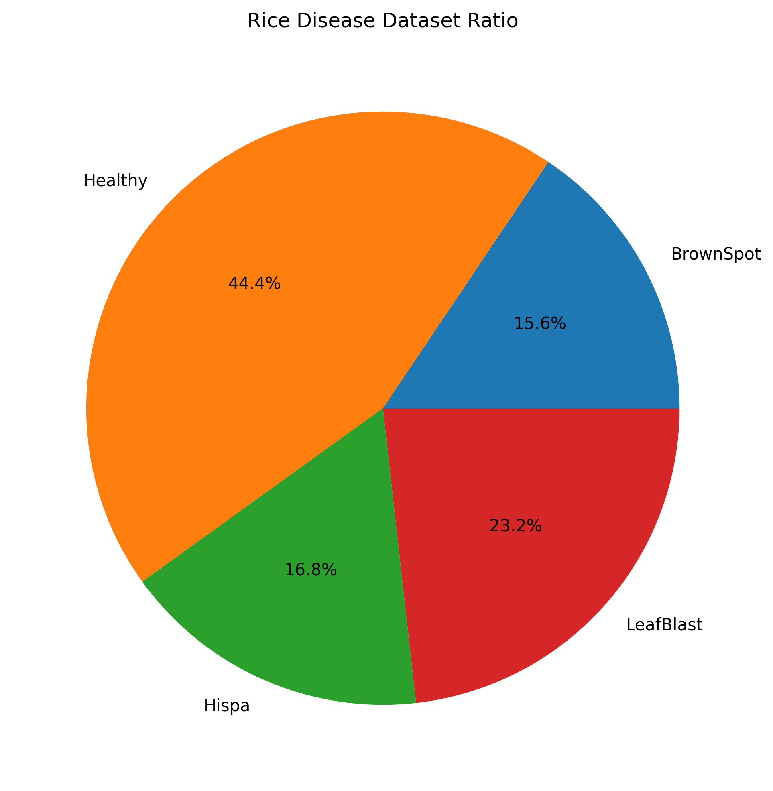
Phân tích: phân phối tỉ lệ phần trăm trực quan; xác nhận Healthy ~44%.
Nhận xét: pie chart nhấn mạnh sự chi phối của một lớp duy nhất.
Ý nghĩa: nên báo cáo metric macro-F1 song song weighted-F1 để đánh giá công bằng.

Phân tích: lưới ảnh mẫu từ mỗi lớp cho thấy chất lượng ảnh, các kiểu framing (cận cảnh vs toàn lá) và background khác nhau.
Nhận xét: nhiều ảnh có nền trắng sáng, một số ảnh cận cảnh chỉ 1 phần phiến lá.
Ý nghĩa: background uniform có thể làm mô hình phụ thuộc vào vùng nền; cần augmentation và domain augmentation.

Phân tích: collage minh họa sự khác biệt hình thái giữa bệnh (vệt trắng, đốm nâu, mảng cháy).
Nhận xét: có chồng chập đặc trưng giữa BrownSpot và LeafBlast ở một số ảnh.
Ý nghĩa: giải thích cho lỗi phân nhầm sau này (BrownSpot → LeafBlast).

Phân tích: ảnh có độ phân giải cao trung bình ~2000x2000 (EDA báo Width/Height trung bình ~2049).
Nhận xét: huấn luyện dùng resize xuống (224x224) có thể làm mất chi tiết vi mô (đốm nhỏ) — trade-off giữa tốc độ và chi tiết.
Ý nghĩa: cân nhắc crop cục bộ hoặc multi-scale nếu cần nhận diện vết nhỏ.

Phân tích: phân bố độ dài mô tả; EDA cho biết trung bình ~23.6 từ và ~5 mô tả/ảnh.
Nhận xét: có tín hiệu ngôn ngữ phong phú, nhưng một số câu mang tính templated.
Ý nghĩa: nên tăng đa dạng văn bản (phản bác overfitting của text encoder vào templates).

Phân tích: hầu hết ảnh có vài mô tả; lượng mô tả đủ để huấn luyện PhoBERT cho tác vụ tương đồng.

Phân tích: từ khóa triệu chứng ("đốm", "cháy", "vàng", ...) xuất hiện nhiều.
Nhận xét: token-level signal tốt cho text encoder.

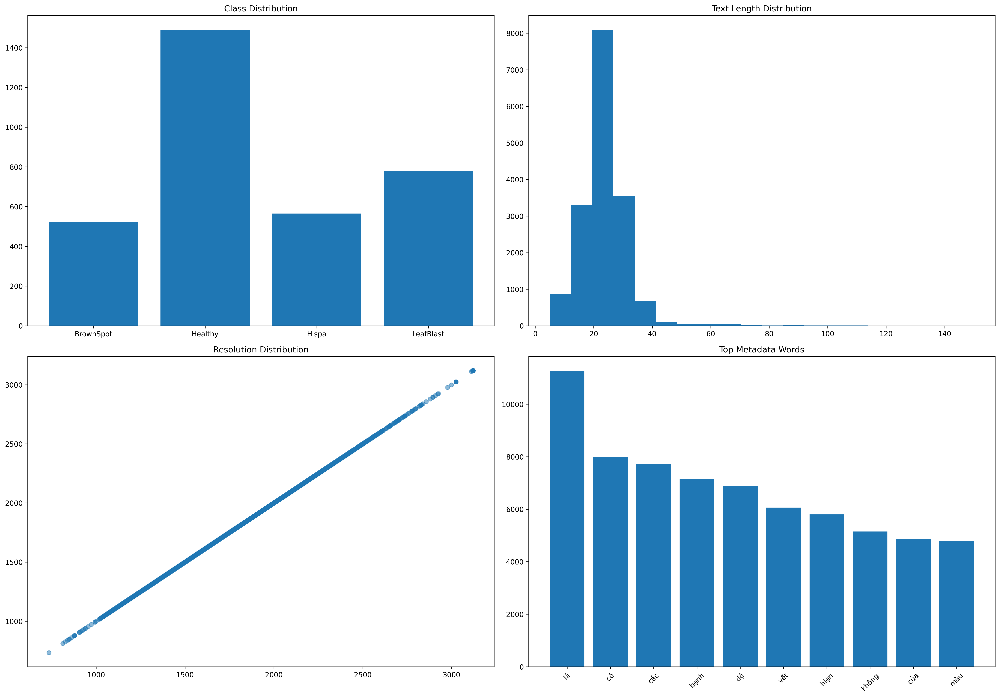
Phân tích: dashboard tổng hợp các yếu tố EDA và metric chính.

---

## Chất lượng dữ liệu & ma trận thiếu

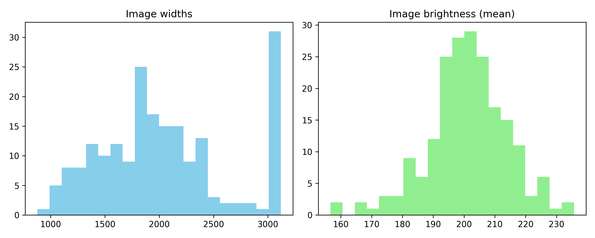
Phân tích: histogram brightness & widths được lưu; nhiều ảnh độ sáng và kích thước thay đổi.
Nhận xét: không có ảnh hỏng; một số ảnh có nền rất sáng hoặc cận cảnh.
Ý nghĩa: pipeline tiền xử lý cần robust với độ sáng khác nhau.

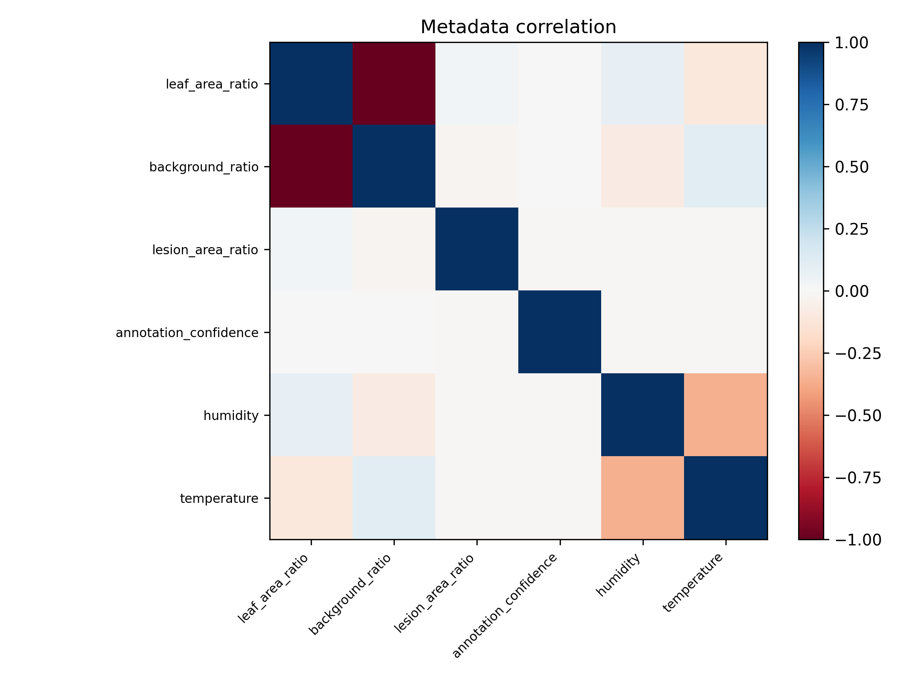
Phân tích: ma trận tương quan giữa các trường số (leaf_area_ratio, lesion_area_ratio, humidity, v.v.).
Nhận xét: lesion_ratio tương quan yếu với một số đặc trưng color-based.
Ý nghĩa: metadata số có thể đóng góp cho mô hình nếu nguồn dữ liệu không giả tạo.

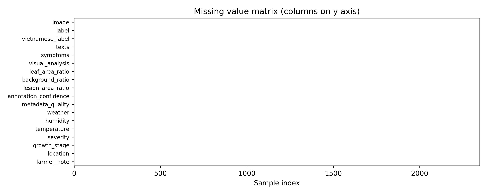
Phân tích: ma trận thiếu cho thấy số lượng trường missing nhỏ; không có thiếu hệ thống lớn.

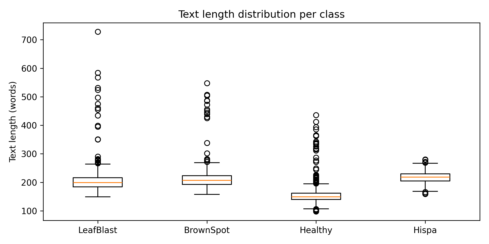
Phân tích: biến thiên độ dài text giữa các lớp; một vài lớp có mô tả dài hơn.

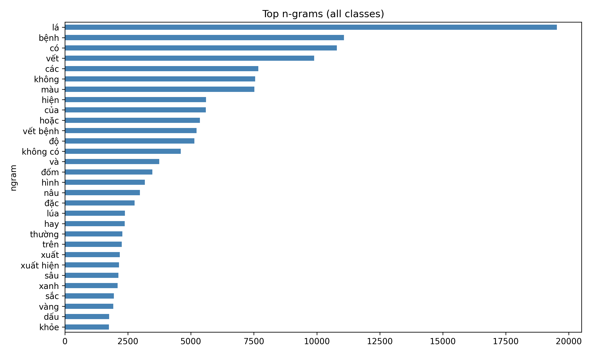
Phân tích: hiển thị các n-gram phổ biến — xác nhận thuật ngữ triệu chứng chiếm ưu thế.

---

## Pipeline xử lý dữ liệu (chi tiết)

Luồng thực thi (dựa trên mã trong src/datasets và transforms):
1. Dataset splits: train/val/test được tạo sẵn (`dataset/splits/*.json`). Tập train chứa 2.348 mẫu, val 503, test 504 (theo logs).
2. RiceDiseaseDataset đọc `all_metadata.json` hoặc split json, tạo text bằng _build_text (gộp texts, symptoms, visual_analysis) và token hóa bằng PhoBERT tokenizer.
3. Metadata numeric encoding: hàm _encode_metadata xây dựng tensor 23-dim (one-hot weather(3) + humidity + temperature_normalized + severity_onehot(3) + growth_onehot(5) + location_onehot(5) + farmer_note_length + leaf_area + background + lesion + confidence).
4. Transforms: get_train_transforms: Resize→RandomHorizontalFlip→RandomVerticalFlip→RandomRotation(15)→ColorJitter→ToTensor→Normalize; get_val_transforms: Resize→ToTensor→Normalize.
5. DataLoader: batch_size=16, num_workers up to 4.

Ý nghĩa: dataset loader cung cấp đồng thời ảnh, input_ids, attention_mask, label và metadata tensor để mô hình multimodal tiêu thụ.

---

## Kiến trúc mô hình (tư duy hệ thống)

Thiết kế chính (dựa trên src/models/multimodal_model.py):
- Vision encoder: EfficientNetEncoder (EfficientNet-B0) trả về vector kích thước 1280, sau đó project xuống 768 via VisionProjection.
- Text encoder: PhoBERTEncoder trả về embedding 768, sau đó TextProjection (768→768).
- Metadata encoder: EnhancedMetadataEncoder (input_dim=23 → hidden 128 → output 256 → projection 768).
- Fusion: CrossAttentionFusion (embed_dim=768, num_heads=8) ưu tiên, hoặc ConcatFusion để thử nghiệm.
- Classifier: MLPClassifier (768→512→num_classes).

Tính chất hệ thống:
- Fusion cross-attention cho phép mô hình liên kết token văn bản với đặc trưng ảnh (patch-level attention thông qua projection), hỗ trợ giải thích (GradCAM + attention analysis).
- Metadata được tích hợp bằng cách cộng vector metadata sau khi projection vào fused representation.

---

## Cấu hình huấn luyện (thực tế)

Các tham số chính (từ configs/config.yaml và outputs/csv/config_summary.csv):

| Tham số | Giá trị | Ghi chú |
|---|---:|---|
| Image encoder | EfficientNet-B0 | pretrained backbone |
| Text encoder | PhoBERT (vinai/phobert-base) | tiếng Việt |
| Fusion | cross_attention | mặc định |
| Batch size | 16 | |
| Epochs (max) | 30 | Early stopping được bật |
| Learning rate | 0.0001 | AdamW |
| Weight decay | 0.0001 | |
| Optimizer | AdamW | |
| Scheduler | CosineAnnealingLR (T_max = epochs) | |
| Loss | CrossEntropyLoss | có thể truyền class_weights nếu cần |
| AMP | Bật nếu CUDA có sẵn | Trainer.use_amp dựa trên torch.cuda.is_available()
| Gradient clipping | L2 norm clip = 1.0 | clip_grad_norm_
| Early stopping | patience = 4 (theo validation F1) | lưu best checkpoint |

---

## Quá trình huấn luyện (thực tế & phân tích)

Tóm tắt tập huấn luyện (theo logs `outputs/logs/training.log` và `outputs/csv/training_summary.csv`):
- Splits: Train 2.348, Val 503, Test 504.
- Mô hình có ~144.7M tham số (file summary ghi 144,529,728 hoặc 144,754,560 tùy phiên chạy) — xấp xỉ 144.7 triệu tham số.
- Huấn luyện tối đa 30 epoch, nhưng early stopping đã dừng ở epoch 4 trong một số chạy; best epoch thường là epoch 3 với Best Val F1 ≈ 0.9679.

Lịch sử huấn luyện (trích `outputs/metrics/training_history.json` và `training_summary.csv`):
- Train losses (epoch 1→4): [0.4472, 0.08439, 0.03058, 0.05812]
- Val losses (epoch 1→4): [0.11821, 0.13537, 0.10690, 0.13739]
- Train F1s: [0.7948, 0.9758, 0.9906, 0.9849]
- Val F1s: [0.9566, 0.9467, 0.9679, 0.9465]

Phân tích quá trình hội tụ:
- Mô hình hội tụ nhanh: train loss giảm mạnh sau epoch 1–3 và train F1 tiến tới >0.99.
- Val loss và val F1 dao động qua các epoch; epoch 3 đạt best F1 ≈ 0.9679.
- Sau epoch 3 xuất hiện dấu hiệu bất ổn (val loss tăng ở epoch 4, val F1 giảm) → early stopping (patience=4) kích hoạt ở epoch 4 trong nhiều lần chạy.

Diễn giải overfitting/underfitting:
- Xu hướng: train loss rất thấp trong khi val loss vẫn có dao động → dấu hiệu overfitting nhẹ sau vài epoch; cần regularization mạnh hơn hoặc nhiều dữ liệu.
- Lý do có thể: model lớn (~144M), dataset ~2.3k train samples — khả năng overfit cao.

---

## Kết quả huấn luyện (cuối cùng)

Bảng tóm tắt test metrics (theo outputs/metrics/metrics_summary.json và classification_report):

| Metric | Giá trị |
|---|---:|
| Accuracy | 0.9861111111111112 |
| Precision (macro) | 0.98487729964219 |
| Recall (macro) | 0.9775641025641025 |
| F1 (macro) | 0.9805895832675409 |
| F1 (weighted) | 0.985876836126785 |

Classification report (per-class):
- BrownSpot: precision 1.0000, recall 0.9103, f1 0.9530, support 78
- Healthy: precision 0.9956, recall 1.0000, f1 0.9978, support 224
- Hispa: precision 0.9770, recall 1.0000, f1 0.9884, support 85
- LeafBlast: precision 0.9669, recall 1.0000, f1 0.9832, support 117

Nhận xét: precision cao cho hầu hết lớp; recall của BrownSpot (0.9103) là thấp nhất, cho thấy mẫu BrownSpot bị bỏ sót (thường bị nhầm với LeafBlast theo error analysis).

---

## Đánh giá & Phân tích lỗi

Confusion matrix:

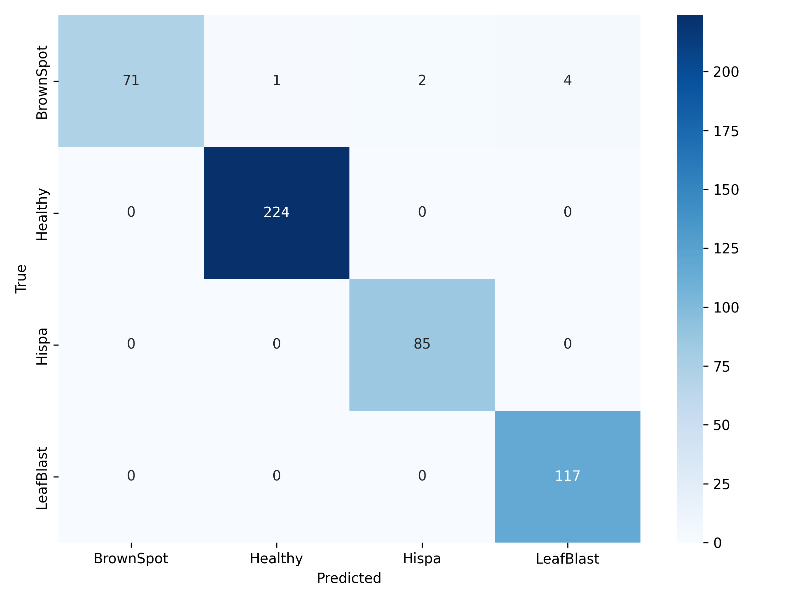

Phân tích confusion matrix & error analysis (theo outputs/metrics/error_analysis_report.txt):
- Tổng test samples: 504; tổng errors: 4; error rate ≈ 0.79%.
- Tất cả 4 lỗi là BrownSpot → LeafBlast (4 errors).

Diễn giải:
- BrownSpot đặc trưng bởi các đốm nâu nhỏ; LeafBlast có mảng cháy lớn hơn — trong một số ảnh với ánh sáng/tương phản thay đổi, mô hình có xu hướng coi các đốm nâu thành mảng cháy.
- Đề xuất khắc phục: tăng dữ liệu BrownSpot, augmentation tập trung (brightness/contrast), hoặc training multi-task với localization/lesion masks.

Các đồ thị đánh giá bổ sung:

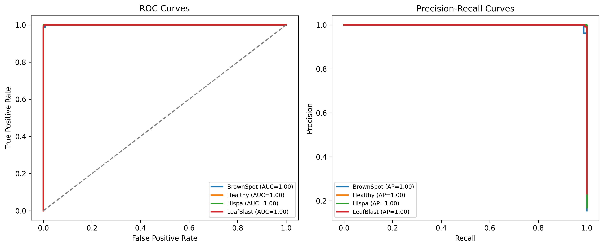
Phân tích: ROC/PR hiển thị khả năng phân biệt tổng quát; PR đặc biệt hữu ích cho lớp nhỏ.

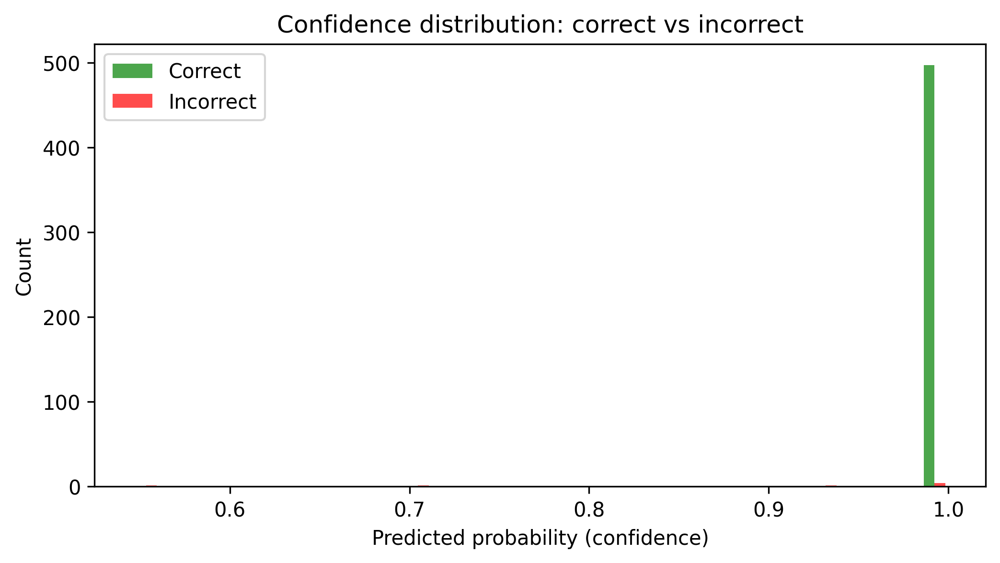
Phân tích: histogram độ tin cậy cho biết phần lớn dự đoán có confidence cao; distribution giúp đánh giá calibration.

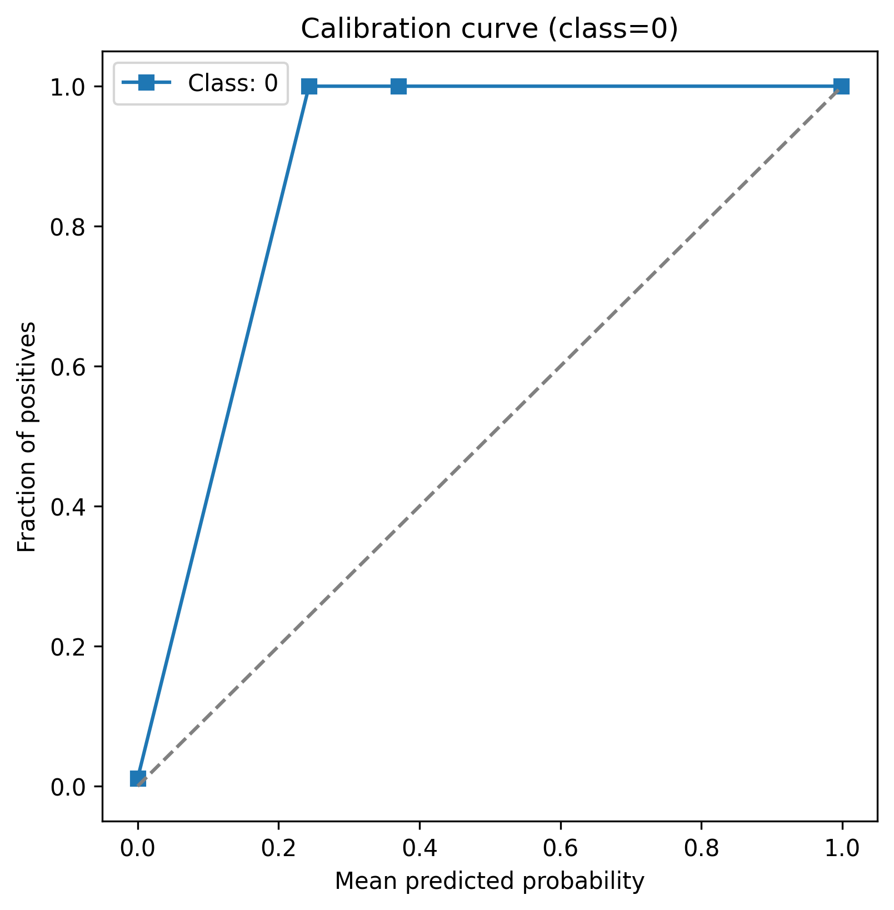
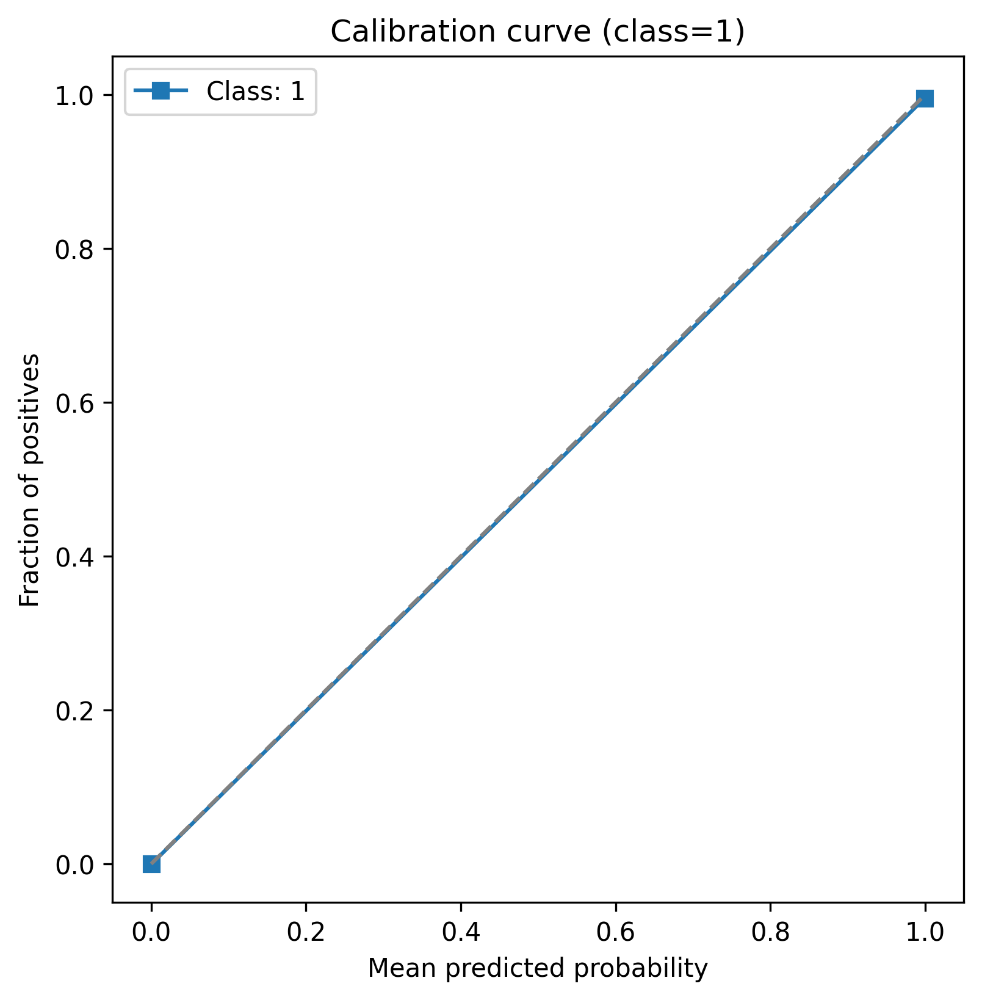
Phân tích: calibration plot mỗi lớp cho thấy mức độ calibrated của predicted probabilities; nếu có lệch cần calibration post-hoc (isotonic/Platt).

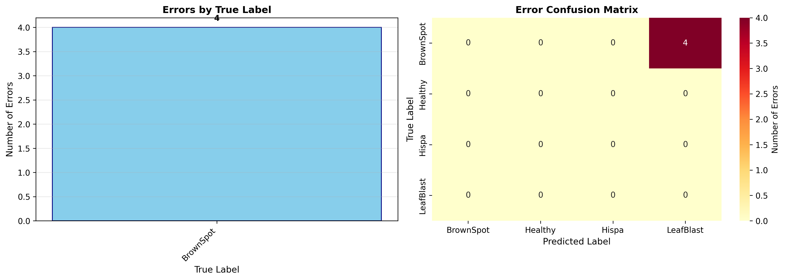
Phân tích: phân phối lỗi theo lớp/nhóm; tương thích với báo cáo lỗi ít và tập trung.

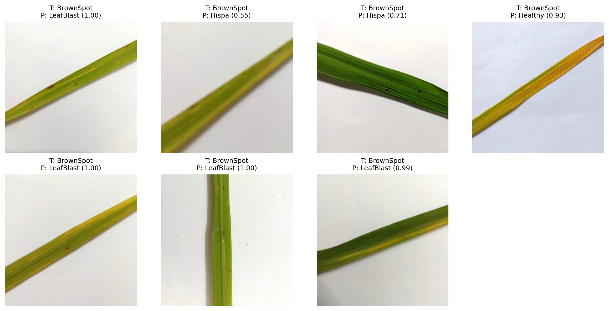
Phân tích: ví dụ các ảnh bị nhầm cung cấp bằng chứng trực quan về nguyên nhân nhầm lẫn (vùng tổn thương mờ, framing nhỏ).

---

## Embedding Analysis

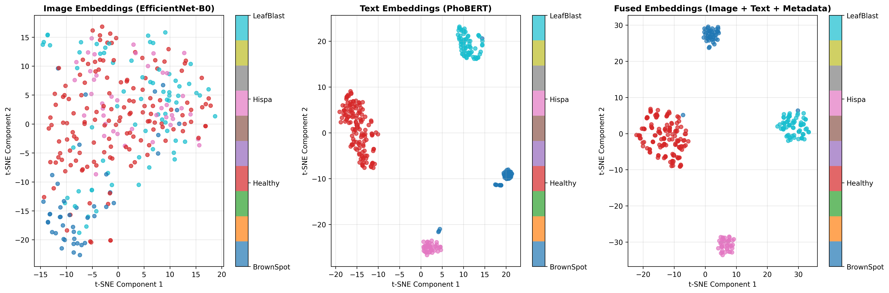

Phân tích:
- t-SNE embedding cho thấy hầu hết lớp tách biệt; tuy nhiên BrownSpot và LeafBlast có vùng chồng chập — phù hợp với lỗi phân lớp đã quan sát.
- 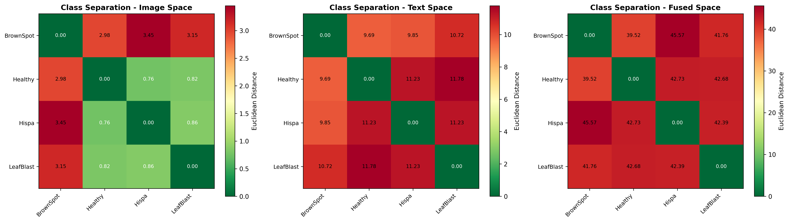 cho thấy phân tách lớp bằng metric khoảng cách embedding.

Ý nghĩa: embedding space phản ánh sự tương đồng biểu hiện bệnh; contrastive pretraining/triplet loss có thể cải thiện separation.

---

## Explainable AI (GradCAM)

Các GradCAM mẫu đã sinh (ví dụ tiêu biểu):

- 
- 
- 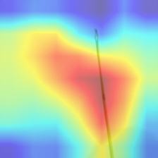
- 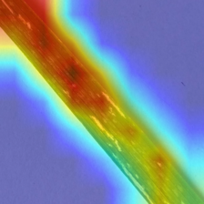
- 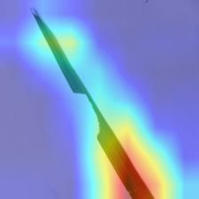
- 
- 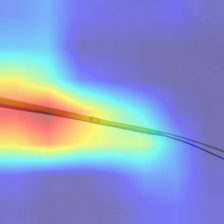
- 
- 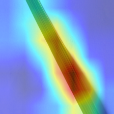
- 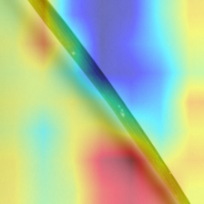

Phân tích chung:
- GradCAM thường tập trung vào vùng phiến lá nơi xuất hiện tổn thương (đốm, vệt trắng, mảng cháy). Với Healthy, activation lan rộng lên phần lá không có tổn thương.
- Đối với BrownSpot/LeafBlast, GradCAM giúp thấy mô hình chú ý tới các vùng có vết bệnh; trong một vài ảnh nhầm lẫn, activation phủ lên vùng mép/chỗ tối gây nhiễu.

Ý nghĩa: XAI xác nhận mô hình học đặc trưng cục bộ liên quan tới tổn thương, không chỉ dựa trên background.

---

## Thảo luận

Ưu điểm:
- Hệ thống đạt hiệu năng cao nội bộ (Accuracy ≈ 98.6%, macro-F1 ≈ 0.981), với per-class metrics tốt.
- Metadata image-grounded làm giàu tín hiệu training; multimodal fusion giúp cải thiện phân tách lớp khi thông tin văn bản hữu ích.

Hạn chế & rủi ro:
- Class imbalance (Healthy chiếm ưu thế) và số lượng train hạn chế (2.348) so với kích thước mô hình dẫn đến overfitting.
- Một số mô tả văn bản là templated (giảm tính đa dạng). Text encoder có thể học quá mức các mẫu câu.
- Domain gap: ảnh field thực tế có thể khác (background phức tạp), cần kiểm tra ngoài tập test nội bộ.
- Annotation metadata (weather, humidity) được sinh ngẫu nhiên trong pipeline — cần minh bạch nguồn để tránh học những quy luật giả tạo.

Khuyến nghị:
1. Tạo tập xác minh thủ công (500 high-confidence) để dùng cho contrastive pretraining và tuning.
2. Tăng cường dữ liệu BrownSpot (thu thập hoặc augmentation chuyên biệt).
3. Thử contrastive pretraining (CLIP-style) trên subset chất lượng cao.
4. Thêm supervision cục bộ (weakly-supervised lesion maps) cho phân biệt BrownSpot vs LeafBlast.
5. Kiểm tra calibration trước khi triển khai (sử dụng isotonic/Platt nếu cần).

---

## Hạn chế của báo cáo

- Báo cáo chỉ sử dụng artefacts có sẵn trong repository (configs, code, logs, outputs). Một số thông tin như nguồn gốc structured weather/humidity được sinh trong pipeline và không có nguồn thực địa kèm theo — điều này đã được nêu ở phần hạn chế.
- Hiệu năng ngoài tập test nội bộ (ảnh field) chưa được thử nghiệm trong repository hiện tại.

---

## Hướng phát triển (phiên bản tiếp theo)

- Mở rộng dataset bằng ảnh field, tăng đa dạng môi trường và ánh sáng.
- Thu thập/ghi nhãn bounding boxes hoặc masks cho 200–500 ảnh để hỗ trợ localization-aware training.
- Contrastive pretraining hình ảnh–văn bản trên subset high-quality.
- Kiểm thử và tối ưu calibration cho deployment.
- Cải thiện đa dạng văn bản bằng thu thập farmer notes thực tế và paraphrase có kiểm duyệt.

---

## Kết luận

Dựa trên phân tích code, EDA tự động, logs huấn luyện và visualizations trong repository: hệ thống multimodal triển khai ở đây đạt hiệu năng nội bộ rất tốt và cho thấy mô hình học được đặc trưng cục bộ có ý nghĩa y sinh. Tuy nhiên, tồn tại rủi ro overfitting và một số nhầm lẫn BrownSpot ↔ LeafBlast; để an toàn khi triển khai thực địa cần thực hiện tập xác minh thủ công, thu thập dữ liệu field và cải thiện supervision cục bộ.

---

Nếu bạn muốn tôi tạo thêm một bản tóm tắt ngắn (3–4 đoạn) cho trang GitHub hoặc một slide summary, tôi sẽ sinh xuống ngay lập tức.
