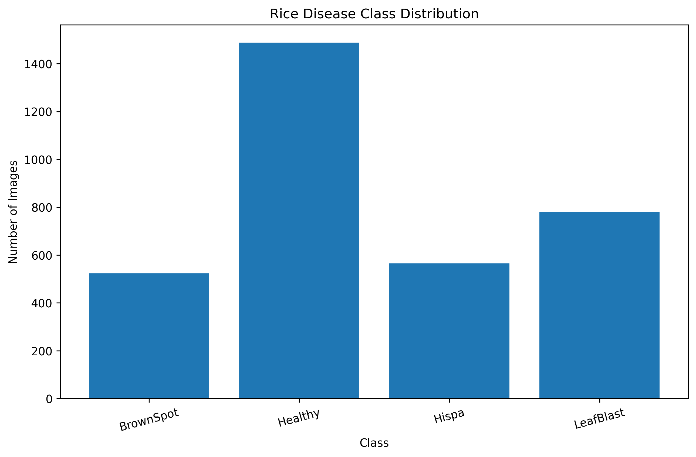
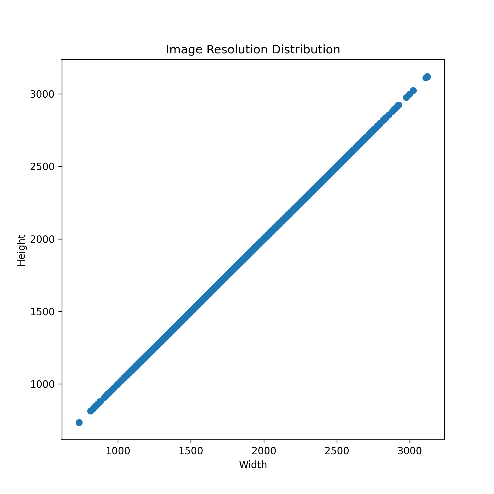
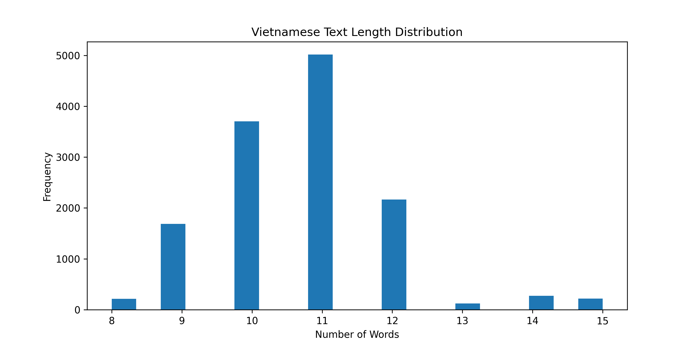
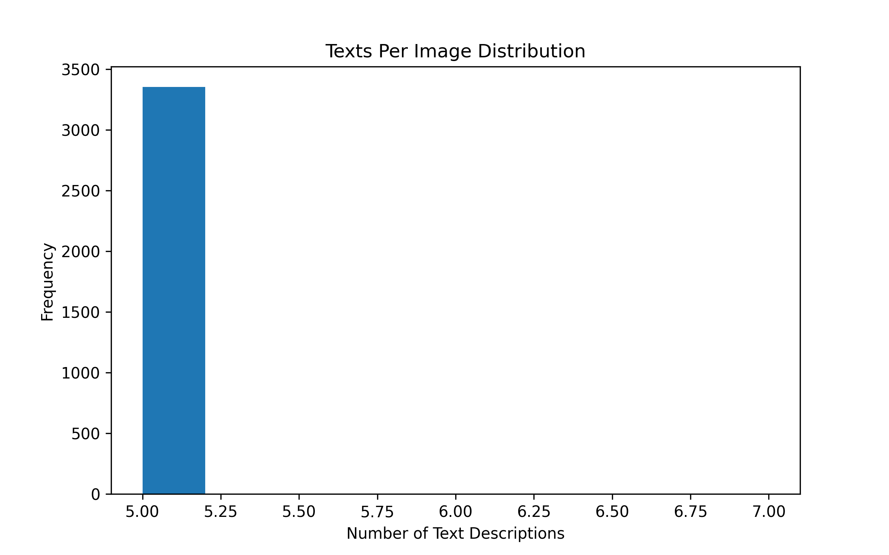

# Vision-Language Rice Leaf Disease Detection

## Overview

Đề tài xây dựng hệ thống Vision-Language AI cho nhận dạng sâu bệnh cây lúa từ:

- ảnh lá lúa
- mô tả hiện trường bằng tiếng Việt

Mục tiêu của đề tài là kết hợp Computer Vision và Natural Language Processing
để nâng cao khả năng nhận dạng bệnh cây trong môi trường nông nghiệp thông minh.

---

# Project Goals

- Nhận dạng bệnh lá lúa từ ảnh
- Kết hợp ảnh + text tiếng Việt
- Tăng độ chính xác nhờ multimodal learning
- Hỗ trợ nông nghiệp thông minh
- Hướng tới triển khai thực tế

---

# Main Architecture

## Vision Encoder
- EfficientNet-B0

## Text Encoder
- PhoBERT

## Fusion Strategy
- Cross Attention
- Feature Concatenation

## Output
- Disease Classification

---

# Disease Classes

Dataset hiện tại gồm 4 lớp:

- BrownSpot
- Healthy
- Hispa
- LeafBlast

---

# Recommended Metrics

## Classification Metrics

- Accuracy
- Precision
- Recall
- F1-score

## Main Metric

- F1-score

Lý do:
Dataset có hiện tượng imbalance giữa các lớp nên F1-score phản ánh hiệu quả tốt hơn Accuracy.

---

# Dataset Structure

```text
dataset/
├── raw/
│   ├── BrownSpot/
│   ├── Healthy/
│   ├── Hispa/
│   └── LeafBlast/
│
├── metadata/
│   ├── all_metadata.json
│   ├── metadata.csv
│   └── metadata_summary.json
│
└── processed/
````

## Metadata Schema

`dataset/metadata/all_metadata.json` is the core multimodal corpus. Each record includes:

- `image`: relative image path inside `dataset/raw`
- `label`: disease category
- `vietnamese_label`: Vietnamese disease name
- `texts`: multiple Vietnamese descriptions grounded in the image
- `symptoms`: disease symptom keywords
- `weather`, `humidity`, `temperature`, `severity`, `growth_stage`, `location`, `farmer_note`
- `visual_analysis`: image-grounded observations of lesion appearance and leaf quality
- `leaf_area_ratio`, `lesion_area_ratio`: quantifiable visual proxies for leaf coverage and damage
- `annotation_confidence`, `metadata_quality`

This schema supports vision-language pretraining, contrastive learning, and multimodal fusion experiments.

---

# Project Structure

```text
CROP-DISEASE-VLM-VIET/
│
├── configs/
├── dataset/
├── docs/
├── notebooks/
├── outputs/
│   ├── analysis/
│   └── visualizations/
│
├── scripts/
├── src/
├── tests/
│
├── README.md
├── requirements.txt
└── .gitignore
```

---

# Recommended Hardware

## Minimum

* RTX 3060 12GB
* RAM 32GB

## Recommended

* RTX 4070
* RTX 4080
* RAM 32GB+

---

# EDA (Exploratory Data Analysis)

## Dataset Statistics

| Class     | Number of Images |
| --------- | ---------------: |
| BrownSpot |              523 |
| Healthy   |             1488 |
| Hispa     |              565 |
| LeafBlast |              779 |

## Total Images

3355

## Total Classes

4

---

# Dataset Insights

## 1. Dataset Imbalance

Class Healthy có số lượng ảnh lớn hơn đáng kể so với các lớp bệnh.

### Potential Issues

* model bias
* over-predict Healthy
* giảm Recall của lớp bệnh
* giảm Macro F1-score

### Recommended Solutions

* Weighted Loss
* Focal Loss
* Data Augmentation
* Stratified Split
* F1-score monitoring

---

## 2. Dataset Quality

### Advantages

* ảnh sạch
* background đơn giản
* ít noise
* object rõ ràng
* resolution cao
* triệu chứng bệnh rõ

### Limitations

* chưa phản ánh điều kiện ngoài thực tế
* thiếu ảnh ánh sáng phức tạp
* thiếu ảnh ngoài đồng ruộng
* domain diversity còn hạn chế

---

## 3. Resolution Consistency

Resolution ảnh khá đồng đều.

Average resolution:

* 2049 x 2049

Điều này phù hợp cho:

* EfficientNet
* Vision Transformer
* CNN training
* Transfer Learning

### Recommended Resize

* 224x224
* 256x256

---

# Multimodal Metadata

Mỗi ảnh được gắn:

* nhiều mô tả tiếng Việt
* triệu chứng bệnh
* mô tả tổn thương lá
* semantic disease descriptions

Ví dụ:

```json
{
  "image": "BrownSpot/img_001.jpg",
  "texts": [
    "Lá lúa xuất hiện nhiều đốm nâu nhỏ.",
    "Phiến lá có các vùng cháy màu nâu.",
    "Triệu chứng bệnh đốm nâu xuất hiện rõ."
  ],
  "label": "BrownSpot"
}
```

---

# Metadata Insights

## Advantages

* Multiple text descriptions per image
* Vietnamese agricultural semantics
* Improved multimodal learning
* Better image-text alignment

## Research Novelty

* Vision-Language learning cho nông nghiệp
* Vietnamese agricultural NLP
* Image-text disease fusion
* Smart farming AI systems

---

# EDA Outputs

## Class Distribution



---

## Dataset Overview


---

## Image Resolution Distribution



---

## Text Length Distribution



---

## Texts Per Image Distribution



---

# Current EDA Features

* Class distribution analysis
* Dataset visualization
* Resolution analysis
* Metadata analysis
* Text distribution analysis
* Corrupted image detection
* Automatic EDA report generation

---

# Recommended Training Pipeline

## Step 1 — Image Preprocessing

* Resize
* Normalize
* Augmentation

## Step 2 — Text Preprocessing

* Vietnamese tokenization
* Text cleaning
* PhoBERT tokenizer

## Step 3 — Feature Extraction

### Vision

* EfficientNet-B0

### NLP

* PhoBERT

## Step 4 — Multimodal Fusion

* Cross Attention
* Feature Concatenation

## Step 5 — Classification

* Fully Connected Layer
* Softmax

## Step 6 — Evaluation

* F1-score
* Precision
* Recall
* Confusion Matrix

---

# Future Work

## Dataset

* Thu thập ảnh thực tế ngoài đồng
* Tăng diversity dữ liệu
* Thêm weather metadata
* Thêm geolocation metadata

## AI Model

* Vision-Language Fusion
* Segmentation
* Explainable AI
* Mobile deployment
* Lightweight inference

## System

* Chatbot nông nghiệp
* Real-time inference
* Edge AI deployment
* Smart farming assistant

---

# Research Direction

Đề tài hướng tới:

* Multimodal AI
* Agricultural AI
* Vietnamese Vision-Language Models
* Smart Farming Systems
* AI for Precision Agriculture

```

