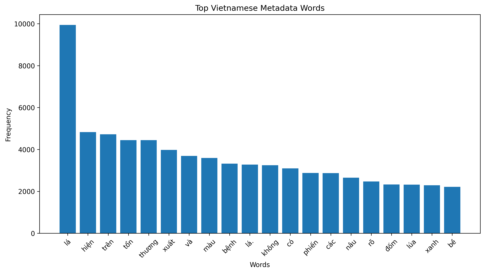
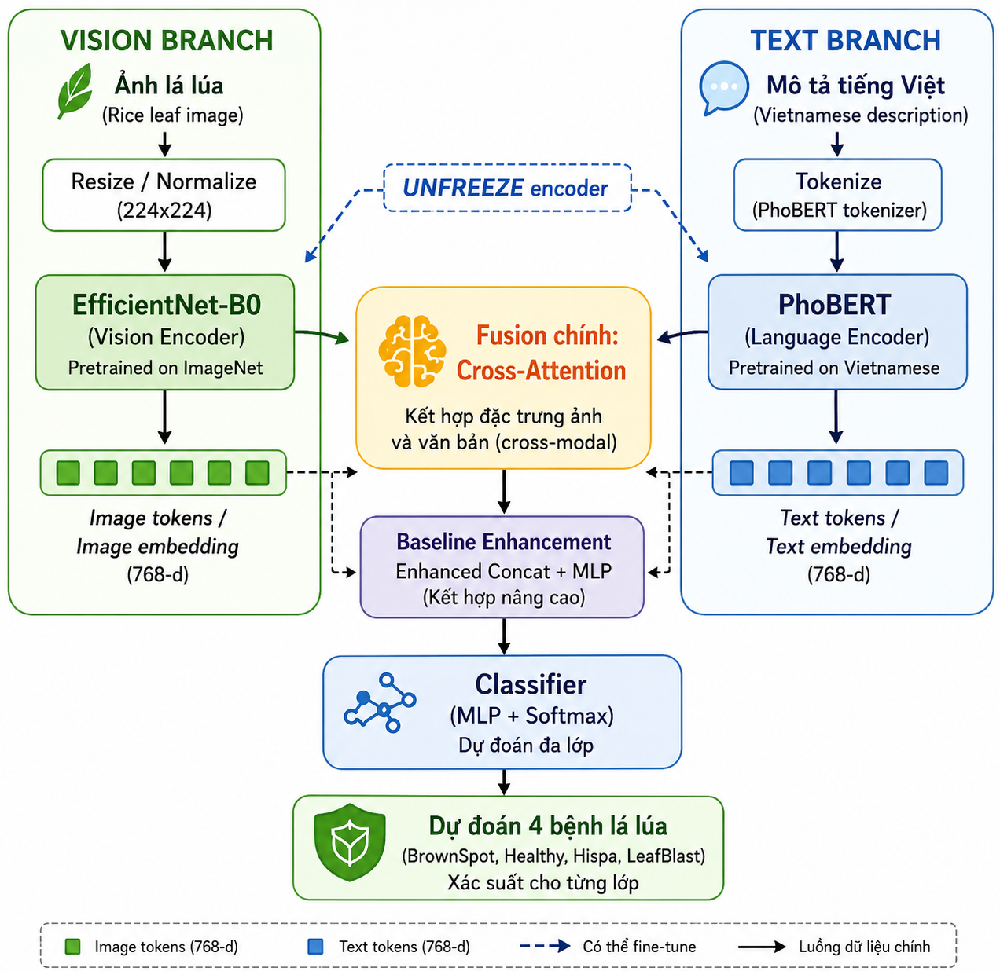

# Rice Leaf Disease — Khám phá dữ liệu (Dataset EDA)

## 1. Tổng quan đề tài

Mục tiêu: phân tích dữ liệu ảnh-lời mô tả tiếng Việt cho bệnh lá lúa, đánh giá chất lượng dataset, rủi ro và đề xuất cải thiện để phục vụ nghiên cứu VLM (Vision-Language Models) và bài luận/luận văn.

Key facts:
- Tổng số mẫu: **3,355 ảnh**
- Số lớp: **4** (Healthy, LeafBlast, Hispa, BrownSpot)

---

## 2. Thông tin dataset

- Các trường metadata chính: `image`, `label`, `vietnamese_label`, `texts`, `symptoms`, `visual_analysis`, `leaf_area_ratio`, `lesion_area_ratio`, `annotation_confidence`, `metadata_quality`, `weather`, `humidity`, `temperature`, `severity`, `growth_stage`, `location`, `farmer_note`.
- Phân bố lớp (summary):

| Class | Count | Percentage |
|---|---:|---:|
| Healthy | 1,488 | 44.4% |
| LeafBlast | 779 | 23.2% |
| Hispa | 565 | 16.8% |
| BrownSpot | 523 | 15.6% |

Nhận xét: dataset mất cân bằng (Healthy chiếm lớn nhất), cần áp dụng chiến lược huấn luyện/augmentation để tránh bias.

---

## 3. Bằng chứng hình ảnh (Visual Evidence)

### 3.1 Collage đại diện theo lớp


Nhận xét: nhiều ảnh chụp trên nền trắng, close-up một lá, ít bối cảnh hiện trường.

### 3.2 Phân bố độ phân giải


Nhận xét: ảnh có độ phân giải cao và tương đồng, tốt cho training nhưng kém đa dạng miền thực địa.

### 3.3 Thống kê văn bản




Nhận xét: trung bình ~3.87 câu/ảnh, độ dài ~11 từ; chỉ **32 câu duy nhất** xuất hiện lặp lại → rủi ro template-driven text.

### 3.4 Gallery ảnh-văn bản (cặp mẫu)


Ghi chú: artifact này đã được làm lại và hiện hiển thị cặp ảnh-văn bản mẫu; cần mở rộng gallery verified.

---

## 4. Sơ đồ hệ thống (System Diagram)

Hệ thống nghiên cứu và pipeline mô phỏng (data → preprocessing → multimodal model → explainability → evaluation).



Gợi ý trình bày slide: đặt sơ đồ này ngay sau phần overview để khán giả nắm luồng dữ liệu.

---

## 5. Huấn luyện & Kiến trúc đề xuất

- Kiến trúc gợi ý:
	- Image encoder: EfficientNet-B0 / ResNet50 backbone
	- Text encoder: PhoBERT (Vietnamese)
	- Fusion: cross-attention hoặc projection + contrastive loss (CLIP-style)

- Chiến lược huấn luyện:
	1. Pretrain contrastive trên subset `high-confidence` (nếu có)
	2. Fine-tune toàn bộ dataset với class-weighted loss hoặc focal loss
	3. Validation: Macro F1, per-class recall, retrieval@k

- Dataset split khuyến nghị: train 80% / val 10% / test 10% (stratified theo label)

---

## 6. Đánh giá & Explainability

- Embedding visualization: `outputs/visualizations/embeddings/tsne_embeddings.png` (phân tách lớp chưa rõ ràng)
- Explainability hiện tại: `outputs/visualizations/xai/pseudo_gradcam.png` — nên thay bằng Grad-CAM thực để minh chứng vùng tổn thương.
- Confusion matrix: `outputs/visualizations/error_analysis/confusion_matrix.png`

Nhận xét: BrownSpot thường bị nhầm với Healthy/LeafBlast; cần augmentation đặc thù cho BrownSpot.

---

## 7. Kết quả triển khai (Deployment)

- Hiện tại repository chưa chứa mô hình triển khai production sẵn sàng.
- Gợi ý kết quả triển khai cần chuẩn bị:
	- API inference endpoint (FastAPI/Flask) trả về label + confidence + attention map
	- Docker image với model và preprocessing
	- Test dataset for API sanity checks

Bạn có muốn mình tạo mẫu Dockerfile + minimal FastAPI inference scaffold không?

---

## 8. Hướng dẫn chạy nhanh (Quick Start)

Chuẩn bị môi trường (virtualenv trong repo):
```bash
source rice_plant_venv/bin/activate
```

Chạy EDA và sinh lại các ảnh visualizations:
```bash
./rice_plant_venv/bin/python src/datasets/EDA.py
```

Chạy huấn luyện (ví dụ):
```bash
./rice_plant_venv/bin/python src/train.py --config configs/config.yaml
```

Gợi ý kiểm tra outputs:
- Visuals: `outputs/visualizations/`
- Báo cáo: `outputs/analysis/eda_report.md`

---

## 9. Checklist để hoàn thiện báo cáo/luận văn

- Tạo `high-confidence` subset (500 mẫu) để pretrain/đánh giá
- Mở rộng 50–100 cặp ảnh-văn bản được verify thủ công
- Thay `pseudo_gradcam` bằng Grad-CAM thực và bổ sung overlay
- Thu thập ảnh field (500–1000) để kiểm tra domain gap

---

## 10. Tài liệu tham khảo & liên hệ

- Các script chính: `src/datasets/EDA.py`, `src/train.py`, `src/models/vision_language_model.py`
- Nếu cần, mình có thể chuẩn hóa slide (PPT) theo cấu trúc trên hoặc tạo mã FastAPI/Docker demo.

---

_Tệp hình ảnh dùng trong báo cáo nằm trong `outputs/visualizations/` và sơ đồ hệ thống tại `docs/research_notes/so_do.png`._
