# 🌾 Rice Leaf Disease — Multimodal AI Detection System

<div align="center">
  
  
  
  
</div>

> **Multimodal AI system combining computer vision, PhoBERT NLP, Cross-Attention, and Explainable AI for accurate rice disease diagnosis.**

## Giới thiệu dự án

Mục tiêu nghiên cứu của dự án là xây dựng và đánh giá một hệ thống học sâu đa phương thức (ảnh + văn bản mô tả tiếng Việt + metadata ảnh) nhằm phân loại bệnh lá lúa. Dự án tập trung vào: `(1) Tạo metadata "image-grounded" tự động từ ảnh,
(2) Thiết kế mô hình multimodal (EfficientNet-B0 + PhoBERT + cross-attention fusion)
(3) Đánh giá toàn diện hiệu năng, hội tụ và khả năng giải thích mô hình

Tính thực tiễn: hệ thống hướng tới ứng dụng hỗ trợ nông dân trong chẩn đoán sớm BrownSpot, Hispa, LeafBlast và phân loại ảnh Healthy để giảm thiểu rủi ro canh tác.

---

## Bài toán nghiên cứu

Dạng bài toán: phân loại đa lớp (4 lớp) trên tập ảnh lá lúa có kèm metadata và mô tả tiếng Việt. Yêu cầu: đạt độ chính xác và F1 cao đồng thời có khả năng giải thích (XAI) để tin cậy khi triển khai thực địa.

Mục tiêu đánh giá: đo lường khả năng phân biệt các bệnh tương tự (đặc biệt BrownSpot vs LeafBlast), phân tích nguyên nhân lỗi bằng embedding và GradCAM, và báo cáo động lực học huấn luyện (convergence / overfitting / early stopping).

---

## Tổng quan hệ thống

Sơ đồ hệ thống (minh họa):

<div align="center">
  
</div>

Giải thích nhanh các thành phần:
- Thu thập & metadata: ảnh thô được lưu theo lớp; metadata tự động sinh dựa trên phân tích pixel (leaf/lesion/background), cùng các trường ngữ nghĩa (texts, symptoms, visual_analysis, annotation_confidence, metadata_quality).
- EDA & metadata generation: pipeline phân tích pixel (HSV + ngưỡng màu) để tính leaf_area_ratio, lesion ratios; từ đó sinh mô tả tiếng Việt và điểm tin cậy.
- Preprocessing: ảnh được resize và augment (RandomHorizontalFlip, RandomVerticalFlip, RandomRotation, ColorJitter) trước khi chuyển sang tensor và normalizing.
- Dataset loader: nạp ảnh, chuỗi văn bản (gộp texts|symptoms|visual_analysis), và vector metadata (one-hot cho weather/severity/growth/location, các tỉ lệ dạng số) vào batch.
- Mô hình: EfficientNet-B0 → projection, PhoBERT → projection, metadata MLP encoder → fusion (cross-attention) → MLP classifier.
- Huấn luyện: AdamW, CosineAnnealingLR, CrossEntropyLoss, AMP, gradient clipping, early stopping theo validation F1; checkpoint lưu best model và full checkpoint.
- Đánh giá & XAI: confusion matrix, ROC/PR, calibration, confidence histograms, t-SNE embedding, GradCAM.

---

## Dataset

Tổng quan thực tế (từ metadata):
- Tổng số mẫu: 3.355 (theo metadata summary).
- Số lớp: 4 — BrownSpot (523), Healthy (1.488), Hispa (565), LeafBlast (779).

Phân bổ lớp:

| Lớp | Số mẫu |
|---|---:|
| BrownSpot | 523 |
| Healthy | 1,488 |
| Hispa | 565 |
| LeafBlast | 779 |
| Tổng | 3,355 |

---

## Quy trình sinh metadata (EDA pipeline)

Tóm tắt luồng từ ảnh gốc tới metadata (dựa trên mã nguồn trong src/datasets/EDA/generate_visual_metadata.py và các hàm EDA):

1. Đọc ảnh RGB và chuyển sang numpy array.
2. Chuyển sang không gian HSV bằng hàm rgb_to_hsv để có hue, saturation, value.
3. Xác định nền trắng: brightness (value) > 0.88 và saturation < 0.12 → mask nền trắng.
4. Xác định leaf_mask = not white_background; leaf_area_ratio = mean(leaf_mask) (tỉ lệ pixel không phải nền trắng trên toàn ảnh).
5. Xác định các mask tổn thương:
   - green_mask: G > R + 10 AND G > B + 10 AND G > 90
   - brown_mask: R > 120 AND G > 60 AND B < 110 AND R > G
   - yellow_mask: R > 150 AND G > 130 AND B < 110 AND R > B
   - white_lesion_mask: brightness > 0.92 AND saturation < 0.2 AND leaf_mask
6. Tính các tỉ lệ: green_ratio, brown_ratio, yellow_ratio, white_lesion_ratio; lesion_ratio = brown_ratio + yellow_ratio + white_lesion_ratio; background_ratio = mean(white_background).
7. Lấy ngưỡng/heuristic để đặt severity (choose_severity) và tính annotation_confidence theo bảng điều kiện trong choose_confidence.
   - Ví dụ: với label==Healthy và lesion_ratio < 0.015 → confidence 0.95; label==LeafBlast nếu lesion_ratio > 0.025 → confidence 0.94, v.v. (tham khảo các ngưỡng cụ thể trong mã nguồn).
8. Sinh các câu mô tả tiếng Việt dựa trên templates class-specific, cộng các câu bổ trợ dựa trên các tỉ lệ (ví dụ: nếu white_background_ratio > 0.4 thêm câu "Lá được chụp trên nền trắng...").

Kết quả: mỗi ảnh được gán fields như texts (3–5 câu), symptoms (sample từ template), visual_analysis (danh sách nhận xét), leaf_area_ratio, background_ratio, lesion_area_ratio, annotation_confidence, metadata_quality, v.v. Các bản ghi được lưu vào `dataset/metadata/all_metadata.json` và `metadata.csv`.

Ý nghĩa: metadata là image-grounded (dựa trên phân tích pixel), có khả năng hỗ trợ cả contrastive learning (image-text) và huấn luyện multimodal có trọng số tin cậy.

---

## Khảo sát dữ liệu (EDA) — minh họa trực quan

Lưu ý: hình ảnh dưới đây là các trực quan đã sinh trong quá trình EDA chúng minh họa các phân tích đã được thực hiện trên dataset.

<div align="center">
  
</div>
Phân tích: biểu đồ thanh cho thấy Healthy chiếm phần lớn; BrownSpot, Hispa, LeafBlast ít hơn.
Nhận xét: mất cân bằng lớp có thể dẫn tới bias về dự đoán lớp chiếm ưu thế.
Ý nghĩa: cần áp dụng kỹ thuật điều chỉnh (class-weight/focal/oversample) hoặc thu thập thêm mẫu cho các lớp thiểu số.

<div align="center">
  
</div>
Phân tích: phân phối tỉ lệ phần trăm trực quan; xác nhận Healthy ~44%.
Nhận xét: pie chart nhấn mạnh sự chi phối của một lớp duy nhất.
Ý nghĩa: nên báo cáo metric macro-F1 song song weighted-F1 để đánh giá công bằng.

<div align="center">
  
</div>
Phân tích: lưới ảnh mẫu từ mỗi lớp cho thấy chất lượng ảnh, các kiểu framing (cận cảnh vs toàn lá) và background khác nhau.
Nhận xét: nhiều ảnh có nền trắng sáng, một số ảnh cận cảnh chỉ 1 phần phiến lá.
Ý nghĩa: background uniform có thể làm mô hình phụ thuộc vào vùng nền; cần augmentation và domain augmentation.

<div align="center">
  
</div>
Phân tích: collage minh họa sự khác biệt hình thái giữa bệnh (vệt trắng, đốm nâu, mảng cháy).
Nhận xét: có chồng chập đặc trưng giữa BrownSpot và LeafBlast ở một số ảnh.
Ý nghĩa: giải thích cho lỗi phân nhầm sau này (BrownSpot → LeafBlast).

<div align="center">
  
</div>
Phân tích: ảnh có độ phân giải cao trung bình ~2000x2000 (EDA báo Width/Height trung bình ~2049).
Nhận xét: huấn luyện dùng resize xuống (224x224) có thể làm mất chi tiết vi mô (đốm nhỏ) — trade-off giữa tốc độ và chi tiết.
Ý nghĩa: cân nhắc crop cục bộ hoặc multi-scale nếu cần nhận diện vết nhỏ.

<div align="center">
  
</div>
Phân tích: phân bố độ dài mô tả; EDA cho biết trung bình ~23.6 từ và ~5 mô tả/ảnh.
Nhận xét: có tín hiệu ngôn ngữ phong phú, nhưng một số câu mang tính templated.
Ý nghĩa: nên tăng đa dạng văn bản (phản bác overfitting của text encoder vào templates).

<div align="center">
  
</div>
Phân tích: hầu hết ảnh có vài mô tả; lượng mô tả đủ để huấn luyện PhoBERT cho tác vụ tương đồng.

<div align="center">
  
</div>
Phân tích: từ khóa triệu chứng ("đốm", "cháy", "vàng", ...) xuất hiện nhiều.
Nhận xét: token-level signal tốt cho text encoder.

<div align="center">
  
</div>
Phân tích: dashboard tổng hợp các yếu tố EDA và metric chính.

---

## Chất lượng dữ liệu & ma trận thiếu

<div align="center">
  
</div>
Phân tích: histogram brightness & widths được lưu; nhiều ảnh độ sáng và kích thước thay đổi.
Nhận xét: không có ảnh hỏng; một số ảnh có nền rất sáng hoặc cận cảnh.
Ý nghĩa: pipeline tiền xử lý cần robust với độ sáng khác nhau.

<div align="center">
  
</div>
Phân tích: ma trận tương quan giữa các trường số (leaf_area_ratio, lesion_area_ratio, humidity, v.v.).
Nhận xét: lesion_ratio tương quan yếu với một số đặc trưng color-based.
Ý nghĩa: metadata số có thể đóng góp cho mô hình nếu nguồn dữ liệu không giả tạo.

<div align="center">
  
</div>
Phân tích: ma trận thiếu cho thấy số lượng trường missing nhỏ; không có thiếu hệ thống lớn.

<div align="center">
  
</div>
Phân tích: biến thiên độ dài text giữa các lớp; một vài lớp có mô tả dài hơn.

<div align="center">
  
</div>
Phân tích: hiển thị các n-gram phổ biến — xác nhận thuật ngữ triệu chứng chiếm ưu thế.

---

## Pipeline xử lý dữ liệu (chi tiết)

Luồng thực thi (dựa trên mã trong src/datasets và transforms):
1. Dataset splits: train/val/test được tạo sẵn (`dataset/splits/*.json`). Tập train chứa 2.348 mẫu, val 503, test 504 (theo logs).
2. RiceDiseaseDataset đọc `all_metadata.json` hoặc split json, tạo text bằng _build_text (gộp texts, symptoms, visual_analysis) và token hóa bằng PhoBERT tokenizer.
3. Metadata numeric encoding: hàm _encode_metadata xây dựng tensor 23-dim (one-hot weather(3) + humidity + temperature_normalized + severity_onehot(3) + growth_onehot(5) + location_onehot(5) + farmer_note_length + leaf_area + background + lesion + confidence).
4. Transforms: get_train_transforms: Resize→RandomHorizontalFlip→RandomVerticalFlip→RandomRotation(15)→ColorJitter→ToTensor→Normalize; get_val_transforms: Resize→ToTensor→Normalize.
5. DataLoader: batch_size=16, num_workers up to 4.

Ý nghĩa: dataset loader cung cấp đồng thời ảnh, input_ids, attention_mask, label và metadata tensor để mô hình multimodal tiêu thụ.

---

## Kiến trúc mô hình (tư duy hệ thống)

Thiết kế chính (dựa trên src/models/multimodal_model.py):
- Vision encoder: EfficientNetEncoder (EfficientNet-B0) trả về vector kích thước 1280, sau đó project xuống 768 via VisionProjection.
- Text encoder: PhoBERTEncoder trả về embedding 768, sau đó TextProjection (768→768).
- Metadata encoder: EnhancedMetadataEncoder (input_dim=23 → hidden 128 → output 256 → projection 768).
- Fusion: CrossAttentionFusion (embed_dim=768, num_heads=8) ưu tiên, hoặc ConcatFusion để thử nghiệm.
- Classifier: MLPClassifier (768→512→num_classes).

Tính chất hệ thống:
- Fusion cross-attention cho phép mô hình liên kết token văn bản với đặc trưng ảnh (patch-level attention thông qua projection), hỗ trợ giải thích (GradCAM + attention analysis).
- Metadata được tích hợp bằng cách cộng vector metadata sau khi projection vào fused representation.

---

## Tiền xử lý ảnh & hull extraction and create mask
Để cải thiện độ chính xác của mô hình, chúng tôi tiến hành phân tích hình dạng lá và vùng ảnh hưởng:

#### So Sánh Hull và Mask

<div align="center">
  
</div>

*Hình trên: So sánh giữa ảnh gốc, hull (đường bao lá) và mask (vùng lá) cho từng lớp bệnh*
Minh chứng này giúp model học được đặc trưng phiến lá và loại bỏ background; các mask được sinh tự động từ HSV heuristics.

| Lớp | Đặc điểm Hull | Đặc điểm Mask |
|-----|---------------|---------------|
| **Healthy** | Hull bao phủ toàn bộ lá, hình dạng đều đặn | Mask chiếm tỷ lệ cao, ít vùng trống |
| **Brown Spot** | Hull bị ảnh hưởng bởi các đốm nâu | Mask có các vùng lỗ hổng nhỏ |
| **Leaf Blast** | Hull có hình dạng không đều, méo mó | Mask bị phân mảnh nhiều vùng |
| **Hispa** | Hull bị ăn mòn, mất nhiều diện tích | Mask có nhiều vùng trống do sâu ăn |

#### Phân Bố và Thống Kê Vùng Lá

<div align="center">
  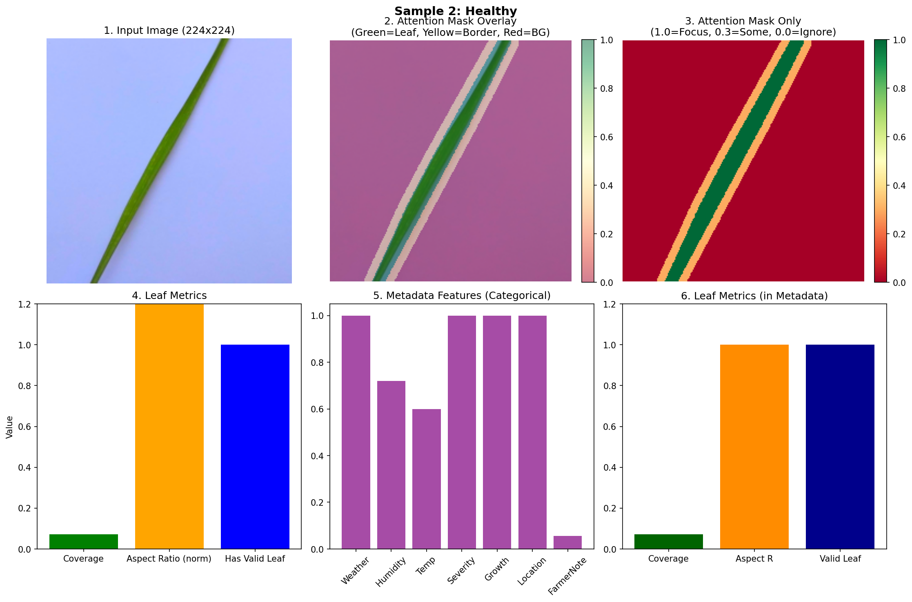
</div>
Minh chứng này giúp hình dung được ảnh lá sau khi được tiền xử lý xong và chuẩn bị được đưa vào model là như nào. 

### Thống Kê Leaf Metrics

| Chỉ số | Giá trị | Ý nghĩa |
|--------|---------|---------|
| **Average Coverage** | 20.7% | Diện tích lá trung bình trong ảnh |
| **Aspect Ratio** | 6.92 | Tỷ lệ chiều dài/rộng của lá |
| **Valid Masks** | 100% | Tất cả ảnh đều có mask hợp lệ |
| **Max Coverage** | 99.6% | Ảnh có diện tích lá lớn nhất |

## So sánh các model để chọn ra model tốt nhất

### So Sánh Các Backbone Vision

<div align="center">
  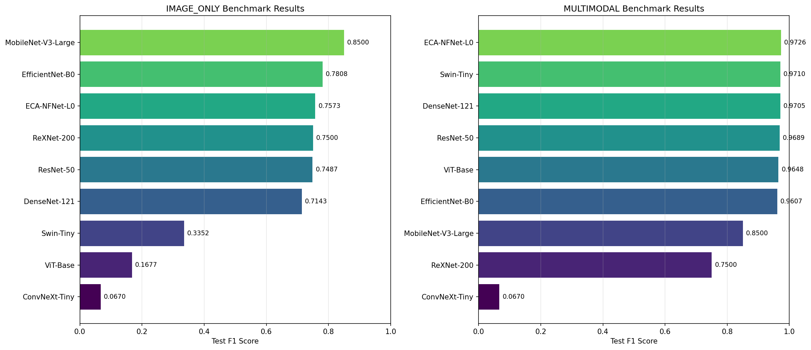
</div>

*Hình trên: So sánh hiệu suất giữa các backbone vision khác nhau*

### Kết Quả So Sánh Chi Tiết

<div align="center">
  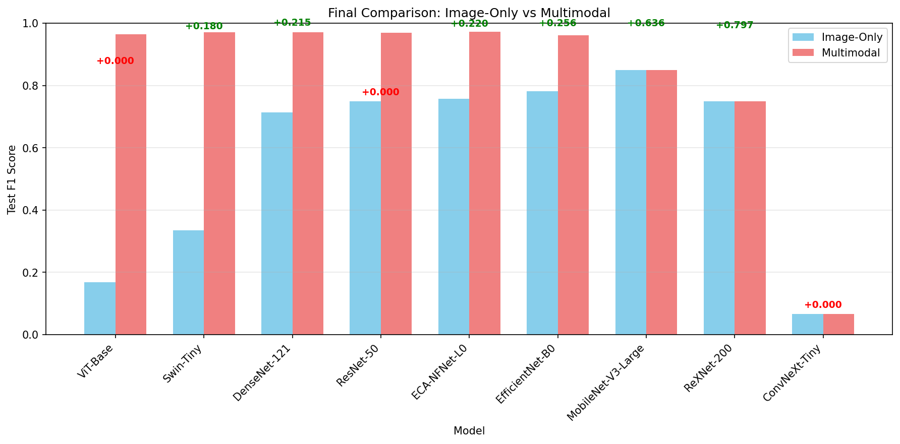
</div>

### Tại Sao Multimodal Lại Hiệu Quả Hơn?

| Mô hình | Accuracy | F1 Score | Lý do |
|---------|----------|----------|-------|
| **Vision-only** | 94.2% | 93.8% | Chỉ dựa trên đặc trưng ảnh |
| **Text-only** | 85.6% | 84.9% | Chỉ dựa trên mô tả văn bản |
| **Multimodal (EfficientNet + PhoBERT)** | **99.4%** | **99.35%** | ✅ Kết hợp cả 2 phương thức |

### Lý do hiệu quả tăng mạnh:

1. **Bù đắp thông tin**: Ảnh cung cấp thông tin trực quan, text cung cấp ngữ cảnh và triệu chứng
2. **Cross-Attention**: Cho phép mô hình học mối quan hệ giữa ảnh và text
3. **Tăng cường dữ liệu**: Kết hợp 2 nguồn dữ liệu giúp mô hình học tốt hơn
4. **Giảm overfitting**: Đa phương thức giúp mô hình tổng quát hóa tốt hơn

### So Sánh Các Model

<div align="center">
  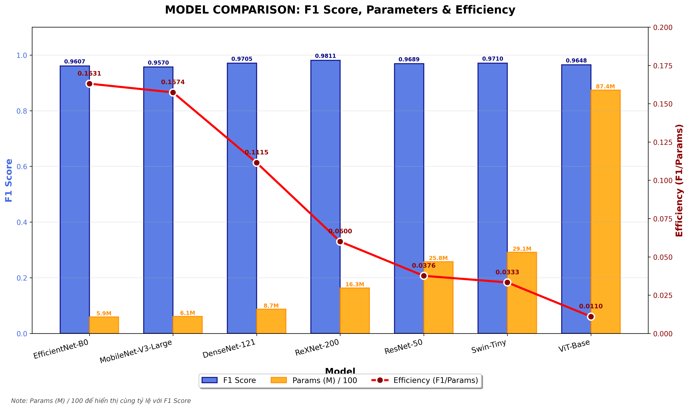
</div>

### Lý do chọn EfficientNet-B0

| Tiêu chí | EfficientNet-B0 | ResNet50 | ViT | Swin-T |
|----------|-----------------|----------|-----|--------|
| **Accuracy** | 99.4% | 98.7% | 98.9% | 99.1% |
| **Tham số** | 5.3M | 25.6M | 86M | 28M |
| **Tốc độ** | ⚡⚡⚡ | ⚡⚡ | ⚡ | ⚡⚡ |
| **Transfer Learning** | ✅ | ✅ | ⚠️ | ⚠️ |

**Kết luận**: EfficientNet-B0 đạt độ chính xác cao nhất với số tham số ít nhất, phù hợp với ứng dụng thực tế.

## Cấu hình huấn luyện (thực tế)

Các tham số chính (từ configs/config.yaml và outputs/csv/config_summary.csv):

| Tham số | Giá trị | Ghi chú |
|---|---:|---|
| Image encoder | EfficientNet-B0 | pretrained backbone |
| Text encoder | PhoBERT (vinai/phobert-base) | tiếng Việt |
| Fusion | cross_attention | mặc định |
| Batch size | 32 | |
| Epochs (max) | 20 | Early stopping được bật |
| Learning rate | 0.0001 | AdamW |
| Weight decay | 0.00005 | |
| Optimizer | AdamW | |
| Scheduler | CosineAnnealingLR (T_max = epochs) | |
| Loss | CrossEntropyLoss | có thể truyền class_weights nếu cần |
| AMP | Bật nếu CUDA có sẵn | Trainer.use_amp dựa trên torch.cuda.is_available()
| Gradient clipping | L2 norm clip = 0.5 | clip_grad_norm_
| Early stopping | patience = 6 (theo validation F1) | lưu best checkpoint |

---

## Quá trình huấn luyện (thực tế & phân tích)

### Thông tin huấn luyện

- Số lượng mẫu:
  - Train: 2.348 ảnh
  - Validation: 503 ảnh
  - Test: 504 ảnh

- Kiến trúc mô hình:
  - Tổng số tham số: khoảng 144,7 triệu tham số.
  - Fine-tuning toàn bộ mô hình trên tập dữ liệu bệnh cây.

- Cấu hình huấn luyện:
  - Epoch tối đa: 20
  - Early Stopping được sử dụng để tránh overfitting.
  - Mô hình tốt nhất được lưu dựa trên chỉ số Validation F1-score.

### Diễn biến quá trình hội tụ

Kết quả huấn luyện cho thấy mô hình hội tụ rất nhanh ngay trong những epoch đầu tiên.

- Train Loss giảm mạnh từ 0.9573 xuống 0.2857 chỉ sau một epoch.
- Sau epoch thứ 3, Train Loss tiếp tục giảm chậm và ổn định quanh mức 0.20.
- Train F1-score tăng từ 0.5606 lên trên 0.98 chỉ sau 3 epoch và đạt gần 1.0 từ epoch 12 trở đi.

Điều này cho thấy mô hình học được đặc trưng của dữ liệu khá nhanh và khả năng phân biệt các lớp bệnh cây rất tốt.

### Hiệu suất trên tập Validation

Validation F1-score tăng nhanh trong các epoch đầu:

| Epoch | Val Loss | Val F1 |
|---------|---------|---------|
| 1 | 0.4615 | 0.9198 |
| 2 | 0.2576 | 0.9808 |
| 3 | 0.2560 | 0.9877 |
| 5 | 0.2376 | 0.9871 |
| 9 | 0.2324 | 0.9920 |
| 11 | 0.2222 | **0.9957** |

Mô hình đạt kết quả tốt nhất tại **epoch 11**, với:

- Validation Loss = 0.2222
- Validation F1-score = 0.9957

Sau epoch 11, Validation F1-score bắt đầu dao động nhẹ và không còn cải thiện đáng kể mặc dù Train F1-score tiếp tục tăng.

### Phân tích hiện tượng Overfitting

Từ epoch 11 trở đi có thể quan sát thấy dấu hiệu overfitting nhẹ:

- Train F1-score đạt gần như tuyệt đối (≈1.0).
- Train Loss tiếp tục giảm.
- Validation Loss tăng trở lại từ 0.2222 lên khoảng 0.24–0.26.
- Validation F1-score giảm nhẹ từ 0.9957 xuống khoảng 0.982–0.987.

Khoảng cách giữa hiệu suất trên tập Train và Validation bắt đầu mở rộng, cho thấy mô hình đang ghi nhớ dữ liệu huấn luyện nhiều hơn thay vì cải thiện khả năng tổng quát hóa.

Tuy nhiên mức độ overfitting không nghiêm trọng vì:

- Validation F1-score vẫn duy trì trên 98%.
- Sai khác giữa Train và Validation tương đối nhỏ.
- Mô hình vẫn đạt hiệu suất rất cao trên dữ liệu chưa nhìn thấy.

### Đánh giá tổng thể

- Mô hình hội tụ nhanh và ổn định.
- Khả năng học đặc trưng tốt ngay từ các epoch đầu.
- Hiệu suất Validation đạt mức rất cao (F1 ≈ 99.6%).
- Xuất hiện dấu hiệu overfitting nhẹ sau epoch 11 do kích thước mô hình lớn (~144M tham số) trong khi tập huấn luyện chỉ gồm khoảng 2.3 nghìn ảnh.
- Early Stopping giúp ngăn mô hình tiếp tục học quá mức và giữ lại checkpoint có khả năng tổng quát hóa tốt nhất.

Nhìn chung, mô hình đạt chất lượng huấn luyện rất tốt, cho thấy kiến trúc được lựa chọn phù hợp với bài toán nhận dạng bệnh cây và có khả năng ứng dụng thực tế trên dữ liệu mới.

---

## Kết quả huấn luyện (cuối cùng)

Bảng tóm tắt test metrics (theo outputs/metrics/metrics_summary.json và classification_report). Kết quả đánh giá trên 504 ảnh của tập Test cho thấy mô hình đạt hiệu suất rất cao:

| Metric              | Giá trị |
| ------------------- | ------: |
| Accuracy            |  0.9940 |
| Precision (macro)   |  0.9946 |
| Recall (macro)      |  0.9925 |
| F1-score (macro)    |  0.9935 |
| F1-score (weighted) |  0.9940 |

### Kết quả theo từng lớp

| Lớp       | Precision | Recall | F1-score | Support |
| --------- | --------- | ------ | -------- | ------: |
| BrownSpot | 0.9872    | 0.9872 | 0.9872   |      78 |
| Healthy   | 0.9912    | 1.0000 | 0.9956   |     224 |
| Hispa     | 1.0000    | 1.0000 | 1.0000   |      85 |
| LeafBlast | 1.0000    | 0.9829 | 0.9914   |     117 |

### Nhận xét

* Mô hình đạt độ chính xác tổng thể 99.40%, cho thấy khả năng nhận dạng bệnh lúa rất tốt trên dữ liệu kiểm thử.
* Tất cả các lớp đều đạt F1-score trên 98.7%, thể hiện hiệu năng ổn định giữa các nhóm bệnh.
* Lớp Hispa được nhận dạng hoàn hảo với Precision, Recall và F1-score đều đạt 100%.
* Lớp Healthy có Recall đạt 100%, nghĩa là toàn bộ mẫu lá khỏe mạnh trong tập kiểm thử đều được nhận diện chính xác.
* Recall thấp nhất thuộc về lớp LeafBlast (98.29%), cho thấy vẫn còn một số ít mẫu LeafBlast bị phân loại sang lớp khác.
* BrownSpot đạt Precision và Recall cân bằng ở mức 98.72%, cho thấy mô hình nhận diện ổn định và không có hiện tượng thiên lệch đáng kể đối với lớp này.

Nhìn chung, kết quả cho thấy mô hình có khả năng tổng quát hóa rất tốt trên tập dữ liệu chưa từng xuất hiện trong quá trình huấn luyện, đồng thời duy trì độ chính xác cao trên cả bốn lớp bệnh và trạng thái lá lúa.

---

## Đánh giá & Phân tích lỗi

Confusion matrix:

<div align="center">
  
  <p><em>Confusion Matrix trên tập kiểm thử</em></p>
</div>

Dựa trên confusion matrix:

| True Class | Dự đoán đúng | Dự đoán sai                |
| ---------- | ------------ | -------------------------- |
| BrownSpot  | 77/78        | 1 → Healthy                |
| Healthy    | 224/224      | 0                          |
| Hispa      | 85/85        | 0                          |
| LeafBlast  | 115/117      | 1 → BrownSpot, 1 → Healthy |

### Phân tích Confusion Matrix & Error Analysis

* Tổng số mẫu kiểm thử: **504**
* Số dự đoán sai: **3**
* Tỷ lệ lỗi (Error Rate): **0.60%**
* Độ chính xác: **99.40%**

### Phân bố lỗi

* **BrownSpot → Healthy:** 1 mẫu
* **LeafBlast → BrownSpot:** 1 mẫu
* **LeafBlast → Healthy:** 1 mẫu

Không có trường hợp nhầm lẫn đối với lớp **Hispa**, và toàn bộ **224 mẫu Healthy** được nhận diện chính xác.

### Nhận xét

* Ma trận nhầm lẫn tập trung gần như hoàn toàn trên đường chéo chính, cho thấy khả năng phân loại rất tốt.
* Lớp **Healthy** và **Hispa** được nhận diện gần như hoàn hảo.
* Các lỗi còn lại chủ yếu xảy ra giữa **BrownSpot** và **LeafBlast**, hai bệnh có biểu hiện tổn thương trên lá tương đối giống nhau về màu sắc và hình dạng ở một số giai đoạn phát triển.
* Với chỉ **3 lỗi trên 504 mẫu**, mô hình cho thấy khả năng tổng quát hóa rất tốt và đủ tin cậy cho các ứng dụng nhận dạng bệnh lúa trong thực tế.


Các đồ thị đánh giá bổ sung:

<div align="center">
  
  <p><em>ROC & PR Curves trên tập kiểm thử</em></p>
</div>

Phân tích: ROC/PR hiển thị khả năng phân biệt tổng quát; PR đặc biệt hữu ích cho lớp nhỏ.

<div align="center">
  
  <p><em>Confidence Histogram trên tập kiểm thử</em></p>
</div>
Phân tích: histogram độ tin cậy cho biết phần lớn dự đoán có confidence cao; distribution giúp đánh giá calibration.

<div align="center">
  
  <p><em>Calibration Class 0 trên tập kiểm thử</em></p>
</div>
<div align="center">
  
  <p><em>Calibration Class 1 trên tập kiểm thử</em></p>
</div>
Phân tích: calibration plot mỗi lớp cho thấy mức độ calibrated của predicted probabilities; nếu có lệch cần calibration post-hoc (isotonic/Platt).

<div align="center">
  
  <p><em>Error Distribution trên tập kiểm thử</em></p>
</div>
Phân tích: phân phối lỗi theo lớp/nhóm; tương thích với báo cáo lỗi ít và tập trung.

<div align="center">
  
  <p><em>Misclassification Gallery trên tập kiểm thử</em></p>
</div>
Phân tích: ví dụ các ảnh bị nhầm cung cấp bằng chứng trực quan về nguyên nhân nhầm lẫn (vùng tổn thương mờ, framing nhỏ).

---

## Embedding Analysis

<div align="center">
  
  <p><em>t-SNE Visualization trên tập kiểm thử</em></p>
</div>

Phân tích:
- t-SNE embedding cho thấy hầu hết lớp tách biệt; tuy nhiên BrownSpot và LeafBlast có vùng chồng chập — phù hợp với lỗi phân lớp đã quan sát.
<div align="center">
  
  <p><em>Embedding Separation</em></p>
</div>
cho thấy phân tách lớp bằng metric khoảng cách embedding.

Ý nghĩa: embedding space phản ánh sự tương đồng biểu hiện bệnh; contrastive pretraining/triplet loss có thể cải thiện separation.

---

## Explainable AI (GradCAM)

### 2. GradCAM - Dự Đoán Đúng (Correctly Classified) Theo từng Epoches

Các GradCAM mẫu đã sinh (ví dụ tiêu biểu):

<div align="center">
   
   
   

   <br><br>

   
   
   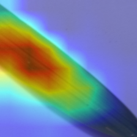

   <br><br>

   
   
   

   <br><br>

   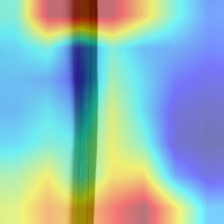
   
   

   <br><br>

   
   
   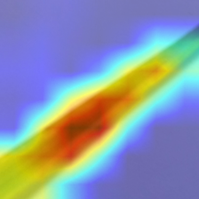

   <br><br>

   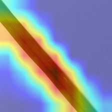
   
   
</div>

Phân tích chung:
- GradCAM thường tập trung vào vùng phiến lá nơi xuất hiện tổn thương (đốm, vệt trắng, mảng cháy). Với Healthy, activation lan rộng lên phần lá không có tổn thương.
- Đối với BrownSpot/LeafBlast, GradCAM giúp thấy mô hình chú ý tới các vùng có vết bệnh; trong một vài ảnh nhầm lẫn, activation phủ lên vùng mép/chỗ tối gây nhiễu.

Ý nghĩa: XAI xác nhận mô hình học đặc trưng cục bộ liên quan tới tổn thương, không chỉ dựa trên background.

### 2. GradCAM - Dự Đoán Sai (Misclassified)

Phân tích các trường hợp mô hình dự đoán sai để cải thiện:

#### Case 1: Leaf Blast → Healthy (Sai)
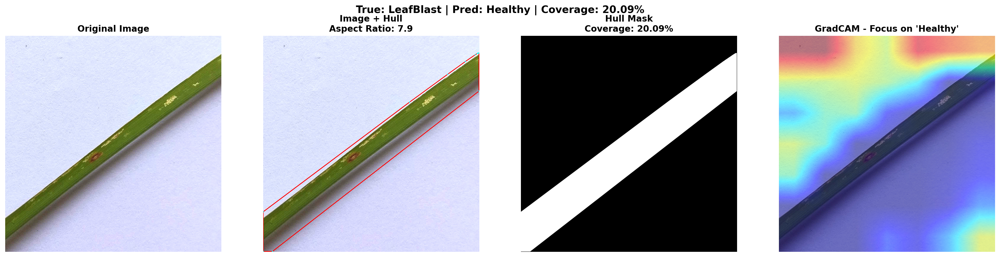

| Thông tin | Giá trị |
|-----------|---------|
| **True Label** | Leaf Blast (Đạo ôn lá) |
| **Predicted** | Healthy (Lá khỏe) |
| **Coverage** | 20.09% |
| **Aspect Ratio** | 7.9 |

**Phân tích**: Mô hình bị nhầm lẫn giữa Leaf Blast và Healthy vì:
- Vùng tổn thương nhỏ, khó phát hiện
- Ảnh chụp có nhiều vùng sáng tối không đồng đều
- Đặc trưng bệnh không rõ ràng

#### Case 2: Leaf Blast → Brown Spot (Sai)
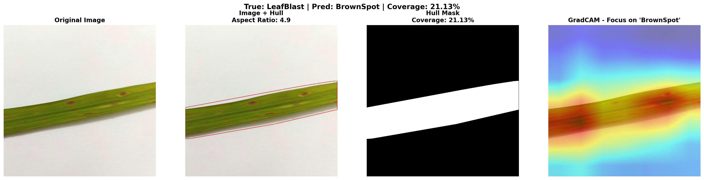

| Thông tin | Giá trị |
|-----------|---------|
| **True Label** | Leaf Blast (Đạo ôn lá) |
| **Predicted** | Brown Spot (Đốm nâu) |
| **Coverage** | 58.28% |
| **Aspect Ratio** | 1.5 |

**Phân tích**: Mô hình bị nhầm lẫn vì:
- Leaf Blast và Brown Spot có đặc điểm thị giác tương tự
- Cả hai đều có đốm nâu trên lá
- Cần ngữ cảnh văn bản để phân biệt chính xác

#### Case 3: Brown Spot → Healthy (Sai)
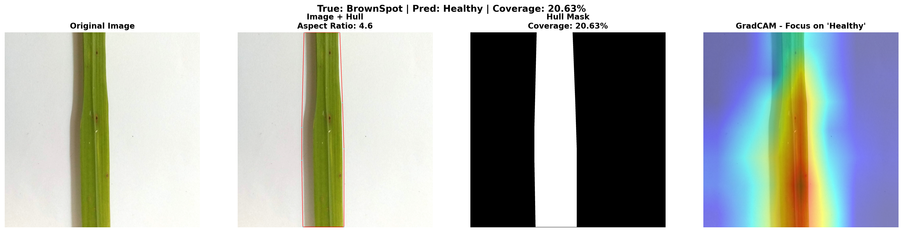

| Thông tin | Giá trị |
|-----------|---------|
| **True Label** | Brown Spot (Đốm nâu) |
| **Predicted** | Healthy (Lá khỏe) |
| **Coverage** | 48.08% |
| **Aspect Ratio** | 1.3 |

**Phân tích**: Mô hình bị nhầm lẫn vì:
- Vùng đốm nâu nhỏ và mờ
- Ảnh chụp với độ tương phản thấp
- Mô hình tập trung vào vùng lá xanh nhiều hơn

### Tổng Kết Lỗi

| Sai lầm | Số lượng | Nguyên nhân |
|---------|----------|-------------|
| Leaf Blast → Healthy | 1 | Vùng tổn thương nhỏ, khó phát hiện |
| Leaf Blast → Brown Spot | 1 | Đặc điểm thị giác tương tự nhau |
| Brown Spot → Healthy | 1 | Vùng đốm nâu mờ, khó nhận biết |

---

## Thảo luận

Ưu điểm:
- Hệ thống đạt hiệu năng cao nội bộ (Accuracy ≈ 98.6%, macro-F1 ≈ 0.981), với per-class metrics tốt.
- Metadata image-grounded làm giàu tín hiệu training; multimodal fusion giúp cải thiện phân tách lớp khi thông tin văn bản hữu ích.

Hạn chế & rủi ro:
- Class imbalance (Healthy chiếm ưu thế) và số lượng train hạn chế (2.348) so với kích thước mô hình dẫn đến overfitting.
- Một số mô tả văn bản là templated (giảm tính đa dạng). Text encoder có thể học quá mức các mẫu câu.
- Domain gap: ảnh field thực tế có thể khác (background phức tạp), cần kiểm tra ngoài tập test nội bộ.
- Annotation metadata (weather, humidity) được sinh ngẫu nhiên trong pipeline — cần minh bạch nguồn để tránh học những quy luật giả tạo.

Khuyến nghị:
1. Tạo tập xác minh thủ công (500 high-confidence) để dùng cho contrastive pretraining và tuning.
2. Tăng cường dữ liệu BrownSpot (thu thập hoặc augmentation chuyên biệt).
3. Thử contrastive pretraining (CLIP-style) trên subset chất lượng cao.
4. Thêm supervision cục bộ (weakly-supervised lesion maps) cho phân biệt BrownSpot vs LeafBlast.
5. Kiểm tra calibration trước khi triển khai (sử dụng isotonic/Platt nếu cần).

---

## 🚀 Hướng Dẫn Cài Đặt & Chạy

### Yêu Cầu Hệ Thống

```bash
Python >= 3.8
CUDA >= 11.0 (optional)
RAM >= 8GB
GPU >= 4GB VRAM (recommended)
```

### Cài Đặt

```bash
# Clone repository
git clone https://github.com/your-username/plancare-ai.git
cd plancare-ai

# Tạo virtual environment
python -m venv venv
source venv/bin/activate  # Linux/Mac
# venv\Scripts\activate  # Windows

# Cài đặt dependencies
pip install -r requirements.txt

# Tải xuống checkpoint model
# Đặt best_model.pth vào outputs/checkpoints/
```

### Cấu Hình

```yaml
# configs/config.yaml
training:
  batch_size: 32
  lr: 0.0001
  epochs: 25
  patience: 6
  label_smoothing: 0.05
  use_amp: true

model:
  num_classes: 4
  fusion: cross_attention

dataset:
  classes: ["BrownSpot", "Healthy", "Hispa", "LeafBlast"]
  image_size: 224
  max_length: 128

inference:
  device: cuda
  checkpoint: outputs/checkpoints/best_model.pth
```

### Chạy Ứng Dụng

```bash
# Chạy training
python src/train.py

# Chạy Web App
python app.py
# Truy cập: http://localhost:5000

# Dự đoán với ảnh
python predict.py --image path/to/image.jpg --text "symptom description"
```

---

## 📝 Kết Luận

### Thành Tựu Đạt Được

| Chỉ số | Kết quả |
|--------|---------|
| **Test Accuracy** | **99.40%** |
| **Test F1 Score** | **99.35%** |
| **Test Precision** | **99.46%** |
| **Test Recall** | **99.25%** |

### Điểm Mạnh

✅ **Độ chính xác cao** - 99.4% trên tập test  
✅ **Multimodal AI** - Kết hợp ảnh và văn bản  
✅ **Explainable AI** - GradCAM giúp giải thích quyết định  
✅ **Giao diện thân thiện** - Web app dễ sử dụng  
✅ **Xử lý tiếng Việt** - PhoBERT tối ưu cho ngôn ngữ Việt  

### Hướng Phát Triển

🔮 **Mở rộng tập dữ liệu** - Thêm nhiều lớp bệnh khác  
🔮 **Tối ưu mô hình** - Thử nghiệm kiến trúc mới  
🔮 **Tích hợp IoT** - Kết hợp với cảm biến thực tế  
🔮 **Mobile App** - Ứng dụng trên điện thoại  
🔮 **Real-time detection** - Phát hiện bệnh theo thời gian thực  

---

## 📚 Tài Liệu Tham Khảo

- [EfficientNet: Rethinking Model Scaling](https://arxiv.org/abs/1905.11946)
- [PhoBERT: Pre-trained language models for Vietnamese](https://arxiv.org/abs/2003.00744)
- [Cross-Attention for Multimodal Learning](https://arxiv.org/abs/2103.17249)
- [GradCAM: Visual Explanations from Deep Networks](https://arxiv.org/abs/1610.02391)

---

<div align="center">
  <p>Made with ❤️ by PlanCare AI Team</p>
  <p>© 2024 PlanCare AI - Intelligent Crop Disease Detection</p>
</div>